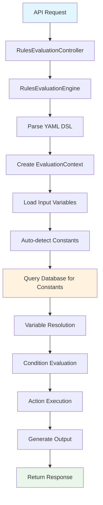

# Firefly Rule Engine

[](https://opensource.org/licenses/Apache-2.0)
[](https://openjdk.java.net/projects/jdk/21/)
[](https://spring.io/projects/spring-boot)
[](https://maven.apache.org/)

A powerful, flexible, and high-performance rule engine designed for the **Firefly OpenCore Banking Platform**. The Firefly Rule Engine enables financial institutions to define, manage, and execute complex business rules using an intuitive YAML-based Domain Specific Language (DSL).

## 🏦 Banking-First Design

Built specifically for financial services, the Firefly Rule Engine excels at:

- **Credit Scoring & Risk Assessment** - Evaluate creditworthiness and financial risk in real-time
- **Anti-Money Laundering (AML)** - Detect suspicious transaction patterns and compliance violations
- **Fraud Detection** - Identify potentially fraudulent activities using complex rule logic
- **Regulatory Compliance** - Implement and maintain compliance rules for various financial regulations
- **Loan Origination** - Automate loan approval workflows with sophisticated decision logic
- **Transaction Monitoring** - Real-time analysis of financial transactions

## ✨ Key Features

### 🚀 **High Performance**
- **Reactive Architecture** - Built on Spring WebFlux for non-blocking, high-throughput processing
- **Concurrent Execution** - Parallel rule evaluation for maximum performance
- **Circuit Breaker Support** - Built-in resilience patterns for production environments

### 📝 **Intuitive YAML DSL**
- **Human-Readable Syntax** - Business users can read and understand rules
- **Rich Operator Support** - Comprehensive set of comparison, logical, and arithmetic operators
- **Banking-Specific Functions** - Pre-built functions for common financial calculations

### 🔧 **Enterprise Ready**
- **RESTful APIs** - Complete REST API for rule evaluation and management
- **YAML DSL Storage** - Store, version, and manage rule definitions in PostgreSQL
- **Database Integration** - PostgreSQL support with R2DBC for reactive data access
- **OpenAPI Documentation** - Auto-generated API documentation with Swagger UI
- **Comprehensive Logging** - Structured JSON logging for observability

### 🏗️ **Modular Architecture**
- **Clean Separation** - Distinct modules for core logic, web APIs, models, and interfaces
- **Extensible Design** - Easy to extend with custom operators and functions
- **SDK Support** - Client SDK for easy integration

## 🏛️ Architecture Overview

The Firefly Rule Engine follows a modular, layered architecture:

```
┌─────────────────────────────────────────────────────────────┐
│                    Web Layer (REST APIs)                    │
│  ┌─────────────┐ ┌─────────────┐ ┌─────────────────────────┐│
│  │ Evaluation  │ │ Rule Mgmt   │ │      Validation         ││
│  │ Controller  │ │ Controller  │ │      Controller         ││
│  └─────────────┘ └─────────────┘ └─────────────────────────┘│
├─────────────────────────────────────────────────────────────┤
│                     Core Engine                             │
│  ┌─────────────┐ ┌─────────────┐ ┌─────────────────────────┐│
│  │ DSL Parser  │ │ Evaluator   │ │    Action Executor      ││
│  └─────────────┘ └─────────────┘ └─────────────────────────┘│
│  ┌─────────────┐ ┌─────────────┐ ┌─────────────────────────┐│
│  │ Validator   │ │ Variable    │ │    Rule Definition      ││
│  │             │ │ Resolver    │ │    Service              ││
│  └─────────────┘ └─────────────┘ └─────────────────────────┘│
├─────────────────────────────────────────────────────────────┤
│                   Data Models & DTOs                        │
├─────────────────────────────────────────────────────────────┤
│                  Database Layer (R2DBC)                     │
│  ┌─────────────┐ ┌─────────────┐ ┌─────────────────────────┐│
│  │ Constants   │ │ Rule        │ │      Migrations         ││
│  │ Repository  │ │ Definitions │ │      & Schema           ││
│  └─────────────┘ └─────────────┘ └─────────────────────────┘│
└─────────────────────────────────────────────────────────────┘
```

### Modules

- **`common-platform-rule-engine-core`** - Core rule evaluation engine, DSL processing, and validation
- **`common-platform-rule-engine-web`** - REST API controllers for evaluation, rule management, and validation
- **`common-platform-rule-engine-models`** - Data entities, repositories, and database schema
- **`common-platform-rule-engine-interfaces`** - DTOs, service interfaces, and contracts
- **`common-platform-rule-engine-sdk`** - Client SDK for integration

## 🚀 Quick Start

### Prerequisites

- **Java 21** or higher
- **Maven 3.8+**
- **PostgreSQL 12+** (for persistence)
- **Docker** (optional, for containerized deployment)

### 1. Clone the Repository

```bash
git clone https://github.com/firefly-oss/common-platform-rule-engine.git
cd common-platform-rule-engine
```

### 2. Configure Database

Set up your PostgreSQL database and configure the connection:

```bash
export DB_HOST=localhost
export DB_PORT=5432
export DB_NAME=firefly_rules
export DB_USERNAME=your_username
export DB_PASSWORD=your_password
export DB_SSL_MODE=disable
```

### 3. Build and Run

```bash
# Build the project
mvn clean install

# Run the application
cd common-platform-rule-engine-web
mvn spring-boot:run
```

The application will start on `http://localhost:8080`

### 4. Access API Documentation

Visit `http://localhost:8080/swagger-ui.html` to explore the interactive API documentation.

## 💾 YAML DSL Storage & Management

The Firefly Rule Engine provides comprehensive YAML DSL storage capabilities, allowing you to:

### 📚 **Store & Version Rule Definitions**
- Store validated YAML DSL definitions in PostgreSQL
- Version control with metadata tracking
- Unique code-based identification system
- Active/inactive status management

### 🔍 **Retrieve & Filter Rules**
- Get rules by UUID or unique code
- Filter by tags, version, creator, or status
- Paginated results for large rule sets
- Full-text search capabilities

### ⚡ **Evaluate Stored Rules**
- Evaluate rules by ID or code without passing YAML content
- Improved performance through pre-validated definitions
- Consistent rule execution across environments
- Audit trail for rule usage

### 🛡️ **Validation & Quality Assurance**
- Comprehensive YAML DSL validation before storage
- Naming convention enforcement
- Dependency analysis and circular reference detection
- Performance optimization suggestions
- Best practices compliance checking

### 📊 **Example: Store and Evaluate a Rule**

```bash
# 1. Store a rule definition
curl -X POST http://localhost:8080/api/v1/rules/definitions \
  -H "Content-Type: application/json" \
  -d '{
    "code": "credit_scoring_v1",
    "name": "Credit Scoring Rule v1",
    "description": "Basic credit scoring for loan applications",
    "yamlContent": "name: \"Credit Scoring\"\ndescription: \"Basic credit assessment\"\n\ninputs:\n  - creditScore\n  - annualIncome\n\nwhen:\n  - creditScore at_least MIN_CREDIT_SCORE\n  - annualIncome at_least MIN_ANNUAL_INCOME\n\nthen:\n  - set is_eligible to true\n  - set approval_tier to \"STANDARD\"\n\nelse:\n  - set is_eligible to false\n  - set approval_tier to \"DECLINED\"\n\noutput:\n  is_eligible: boolean\n  approval_tier: text",
    "version": "1.0",
    "tags": "credit,scoring,loan"
  }'

# 2. Evaluate the stored rule by code
curl -X POST http://localhost:8080/api/v1/rules/evaluate/by-code \
  -H "Content-Type: application/json" \
  -d '{
    "ruleDefinitionCode": "credit_scoring_v1",
    "inputData": {
      "creditScore": 720,
      "annualIncome": 75000
    }
  }'
```

### 🗄️ **Database Schema**

The system uses two main tables for YAML DSL storage:

```sql
-- Rule definitions storage
CREATE TABLE rule_definitions (
    id UUID PRIMARY KEY DEFAULT gen_random_uuid(),
    code VARCHAR(100) NOT NULL UNIQUE,
    name VARCHAR(200) NOT NULL,
    description TEXT,
    yaml_content TEXT NOT NULL,
    version VARCHAR(20),
    is_active BOOLEAN NOT NULL DEFAULT true,
    tags VARCHAR(500),
    created_by VARCHAR(100),
    updated_by VARCHAR(100),
    created_at TIMESTAMP WITH TIME ZONE NOT NULL DEFAULT CURRENT_TIMESTAMP,
    updated_at TIMESTAMP WITH TIME ZONE NOT NULL DEFAULT CURRENT_TIMESTAMP
);

-- System constants storage
CREATE TABLE constants (
    id UUID PRIMARY KEY DEFAULT gen_random_uuid(),
    code VARCHAR(255) NOT NULL UNIQUE,
    name VARCHAR(500) NOT NULL,
    value_type VARCHAR(50) NOT NULL,
    required BOOLEAN NOT NULL DEFAULT false,
    description TEXT,
    current_value JSONB,
    created_at TIMESTAMP WITH TIME ZONE NOT NULL DEFAULT CURRENT_TIMESTAMP,
    updated_at TIMESTAMP WITH TIME ZONE NOT NULL DEFAULT CURRENT_TIMESTAMP
);
```

## 💡 How It Works: Dynamic vs. Static Data

The Firefly Rule Engine intelligently handles three types of data during rule evaluation:

### 🔄 **Dynamic Input Variables** (Runtime Data)
Data passed from your application via the REST API - these change with each request.
**Must use camelCase naming convention:**

```json
{
  "inputData": {
    "creditScore": 720,
    "annualIncome": 75000,
    "employmentYears": 3,
    "requestedAmount": 250000
  }
}
```

### 🏛️ **System Constants** (Database-Stored Configuration)
Predefined values stored in the database that follow `UPPER_CASE_WITH_UNDERSCORES` naming convention:

```sql
-- These are automatically loaded when referenced in rules
INSERT INTO constants (code, name, value_type, current_value) VALUES
('MIN_CREDIT_SCORE', 'Minimum Credit Score', 'NUMBER', 650),
('MAX_LOAN_AMOUNT', 'Maximum Loan Amount', 'NUMBER', 1000000),
('RISK_MULTIPLIER', 'Risk Calculation Multiplier', 'NUMBER', 1.25);
```

### 🧮 **Computed Variables** (Calculated During Evaluation)
Variables calculated during rule execution - **use snake_case naming:**

```yaml
then:
  - calculate debt_to_income as existingDebt / annualIncome
  - calculate loan_to_income as requestedAmount / annualIncome
  - set risk_score to 75
```

## 🎯 Variable Resolution Priority & Naming Conventions

> 📖 **For detailed guidance on what goes in the `inputs` section, see [inputs-section-guide.md](docs/inputs-section-guide.md)**

The system resolves variables in this order and uses distinct naming conventions:

1. **Computed Variables** (highest priority - `snake_case`)
   - Examples: `debt_to_income`, `loan_ratio`, `final_score`
   - Created during rule execution with `calculate` or `set` actions

2. **Input Variables** (medium priority - `camelCase` **required**)
   - Examples: `creditScore`, `annualIncome`, `employmentYears`
   - Passed via API request in the `inputData` field
   - **Must follow camelCase naming convention** (enforced by validation)

3. **System Constants** (lowest priority - `UPPER_CASE_WITH_UNDERSCORES`)
   - Examples: `MIN_CREDIT_SCORE`, `MAX_LOAN_AMOUNT`, `RISK_MULTIPLIER`
   - Stored in database and auto-loaded when referenced

## 💡 Complete Example

Here's how all three types work together:

```yaml
name: "Smart Credit Assessment"
description: "Uses dynamic inputs, system constants, and computed variables"

inputs:
  - creditScore          # camelCase: passed via API
  - annualIncome         # camelCase: passed via API
  - employmentYears      # camelCase: passed via API
  - existingDebt         # camelCase: passed via API

when:
  - creditScore at_least MIN_CREDIT_SCORE    # MIN_CREDIT_SCORE: UPPER_CASE constant from database
  - annualIncome at_least 40000
  - debt_to_income less_than 0.4             # debt_to_income: snake_case computed variable

then:
  - calculate debt_to_income as existingDebt / annualIncome    # snake_case computed variable
  - calculate risk_factor as debt_to_income * RISK_MULTIPLIER # Uses UPPER_CASE DB constant
  - set is_eligible to true                                   # snake_case computed variable
  - set approval_tier to "APPROVED"                           # snake_case computed variable

else:
  - set is_eligible to false
  - set approval_tier to "DECLINED"

output:
  is_eligible: boolean
  approval_tier: text
  debt_to_income: debt_to_income
  risk_factor: risk_factor
```

### API Request Example

```bash
curl -X POST http://localhost:8080/api/v1/rules/evaluation/evaluate \
  -H "Content-Type: application/json" \
  -d '{
    "rulesDefinition": "...",
    "inputData": {
      "creditScore": 720,
      "annualIncome": 75000,
      "employmentYears": 3,
      "existingDebt": 25000
    }
  }'
```

**What happens internally:**
1. System receives `creditScore`, `annualIncome`, etc. as **camelCase input variables**
2. Detects `MIN_CREDIT_SCORE` and `RISK_MULTIPLIER` need to be loaded from database (UPPER_CASE pattern)
3. Automatically queries database for constants matching `^[A-Z][A-Z0-9_]*$` pattern
4. Calculates `debt_to_income` and `risk_factor` as **snake_case computed variables** during rule execution
5. Returns computed results in the response

## 🔍 How Variable Detection Works

The system uses **naming patterns** to automatically determine variable types:

```java
// Input variables: camelCase or any non-UPPER_CASE pattern
if (!isConstantName(variableName)) {
    // Treat as input variable from API request
}

// Constants: UPPER_CASE_WITH_UNDERSCORES pattern
private boolean isConstantName(String name) {
    return name.matches("^[A-Z][A-Z0-9_]*$");
}

// Computed variables: Created explicitly with calculate/set actions
context.setComputedVariable("debt_to_income", calculatedValue);
```

## 📚 Documentation

### Core Documentation
- **[YAML DSL Reference](docs/yaml-dsl-reference.md)** - Complete syntax guide with examples
- **[API Documentation](docs/api-documentation.md)** - REST API reference and examples
- **[Architecture Guide](docs/architecture.md)** - Detailed system architecture and design

### Guides & Tutorials
- **[Developer Guide](docs/developer-guide.md)** - Setup, development, and deployment
- **[User Guide](docs/user-guide.md)** - Step-by-step tutorials for common scenarios
- **[Configuration Reference](docs/configuration.md)** - All configuration options

### Banking Examples
- **[Credit Scoring Rules](examples/credit-scoring-rules.yaml)** - Credit assessment examples
- **[AML Risk Assessment](examples/financial-risk-assessment-rules.yaml)** - Anti-money laundering rules

## 🔧 Configuration

## 🔧 System Constants Management

### Creating Constants via API

System constants are managed through the REST API and stored in PostgreSQL:

```bash
# Create a minimum credit score constant
curl -X POST http://localhost:8080/api/v1/constants \
  -H "Content-Type: application/json" \
  -d '{
    "code": "MIN_CREDIT_SCORE",
    "name": "Minimum Credit Score for Approval",
    "valueType": "NUMBER",
    "required": true,
    "description": "Minimum credit score required for loan approval",
    "currentValue": 650
  }'
```

### Complete Naming Convention Summary

**The system uses naming patterns to automatically determine variable types:**

| Variable Type | Naming Convention | Examples | Source | Validation |
|---------------|-------------------|----------|---------|------------|
| **Input Variables** | `camelCase` (**required**) | `creditScore`, `annualIncome` | API request | **Strictly enforced** |
| **System Constants** | `UPPER_CASE_WITH_UNDERSCORES` | `MIN_CREDIT_SCORE`, `MAX_LOAN_AMOUNT` | Database | Auto-detected by pattern |
| **Computed Variables** | `snake_case` | `debt_to_income`, `final_score` | Rule execution | Enforced during execution |

✅ **Correct Usage:**
```yaml
inputs:
  - creditScore          # camelCase input

when:
  - creditScore at_least MIN_CREDIT_SCORE    # UPPER_CASE constant

then:
  - calculate debt_ratio as totalDebt / annualIncome    # snake_case computed
  - set approval_status to "APPROVED"                   # snake_case computed
```

❌ **Incorrect Usage (creates ambiguity):**
```yaml
inputs:
  - CREDIT_SCORE         # Looks like constant, not input!

then:
  - set FINAL_SCORE to 85    # Should be final_score (snake_case)
```

### Environment Variables

| Variable | Description | Default |
|----------|-------------|---------|
| `DB_HOST` | Database host | `localhost` |
| `DB_PORT` | Database port | `5432` |
| `DB_NAME` | Database name | `firefly_rules` |
| `DB_USERNAME` | Database username | - |
| `DB_PASSWORD` | Database password | - |
| `DB_SSL_MODE` | SSL mode for database | `disable` |
| `SERVER_PORT` | Application port | `8080` |
| `SERVER_ADDRESS` | Server bind address | `localhost` |

### Application Properties

Key configuration options in `application.yaml`:

```yaml
spring:
  application:
    name: common-platform-rule-engine
    version: 1.0.0
    description: Rule Engine Core Application

  r2dbc:
    pool:
      initial-size: 5
      max-size: 10
      max-idle-time: 30m

management:
  endpoints:
    web:
      exposure:
        include: health,info,prometheus
```

## 🔄 Data Flow Architecture



### Variable Resolution Flow

1. **Input Processing**: API request data becomes input variables
2. **Constant Detection**: System scans rule for `UPPER_CASE_NAMES`
3. **Database Query**: Automatically loads matching constants
4. **Priority Resolution**: Computed > Input > Constants
5. **Rule Execution**: Variables resolved during evaluation

## 🧪 Testing

### Run Tests

```bash
# Run all tests
mvn test

# Run integration tests
mvn verify

# Run specific test class
mvn test -Dtest=RulesEvaluationEngineTest
```

### Test Coverage

The project maintains high test coverage with:
- Unit tests for core components
- Integration tests for end-to-end scenarios
- Performance tests for load validation

## 🚀 Deployment

### Docker Deployment

```bash
# Build Docker image
docker build -t firefly-rule-engine .

# Run with Docker Compose
docker-compose up -d
```

### Kubernetes Deployment

```bash
# Apply Kubernetes manifests
kubectl apply -f k8s/
```

### Production Considerations

- **Database Connection Pooling** - Configure appropriate pool sizes
- **Memory Settings** - Tune JVM heap size based on rule complexity
- **Monitoring** - Enable Prometheus metrics and health checks
- **Security** - Configure authentication and authorization as needed

## 🤝 Contributing

We welcome contributions to the Firefly Rule Engine! Please see our [Contributing Guide](CONTRIBUTING.md) for details.

### Development Setup

1. Fork the repository
2. Create a feature branch
3. Make your changes
4. Add tests for new functionality
5. Ensure all tests pass
6. Submit a pull request

### Code Style

- Follow Java coding conventions
- Use meaningful variable and method names
- Add comprehensive JavaDoc comments
- Maintain test coverage above 80%

## 📄 License

This project is licensed under the **Apache License 2.0** - see the [LICENSE](LICENSE) file for details.

```
Copyright 2025 Firefly Software Solutions Inc

Licensed under the Apache License, Version 2.0 (the "License");
you may not use this file except in compliance with the License.
You may obtain a copy of the License at

    http://www.apache.org/licenses/LICENSE-2.0

Unless required by applicable law or agreed to in writing, software
distributed under the License is distributed on an "AS IS" BASIS,
WITHOUT WARRANTIES OR CONDITIONS OF ANY KIND, either express or implied.
See the License for the specific language governing permissions and
limitations under the License.
```

## 🏢 About Firefly Software Solutions

**Firefly Software Solutions Inc** is dedicated to building open-source financial technology solutions that empower financial institutions worldwide. The Firefly OpenCore Banking Platform provides a comprehensive suite of tools for modern banking operations.

### Contact & Support

- **Website**: [https://getfirefly.io](https://getfirefly.io)
- **Email**: [dev@getfirefly.io](mailto:dev@getfirefly.io)
- **Documentation**: [https://docs.getfirefly.io](https://docs.getfirefly.io)
- **Issues**: [GitHub Issues](https://github.com/firefly-oss/common-platform-rule-engine/issues)

---

**Built with ❤️ by the Firefly team for the global financial services community.**