# Firefly Rule Engine

[](https://opensource.org/licenses/Apache-2.0)
[](https://openjdk.java.net/projects/jdk/21/)
[](https://spring.io/projects/spring-boot)
[](https://maven.apache.org/)

A powerful, flexible, and high-performance rule engine designed for the **Firefly OpenCore Banking Platform**. The Firefly Rule Engine enables financial institutions to define, manage, and execute complex business rules using an intuitive YAML-based Domain Specific Language (DSL) with a modern **AST-based (Abstract Syntax Tree) architecture**.

## 🏦 Banking-First Design

Built specifically for financial services, the Firefly Rule Engine excels at:

- **Credit Scoring & Risk Assessment** - Evaluate creditworthiness and financial risk in real-time
- **Anti-Money Laundering (AML)** - Detect suspicious transaction patterns and compliance violations
- **Fraud Detection** - Identify potentially fraudulent activities using complex rule logic
- **Regulatory Compliance** - Implement and maintain compliance rules for various financial regulations
- **Loan Origination** - Automate loan approval workflows with sophisticated decision logic
- **Transaction Monitoring** - Real-time analysis of financial transactions

## ✨ Key Features

### 🚀 **High Performance AST Architecture**
- **AST-Based Processing** - Modern Abstract Syntax Tree architecture for type-safe, optimized rule evaluation
- **Reactive Architecture** - Built on Spring WebFlux for non-blocking, high-throughput processing
- **Visitor Pattern** - Clean separation of concerns with extensible visitor-based operations
- **Zero String Parsing Overhead** - Direct AST traversal eliminates runtime parsing costs
- **Circuit Breaker Support** - Built-in resilience patterns for production environments

### 📝 **Intuitive YAML DSL with Advanced Validation**
- **Human-Readable Syntax** - Business users can read and understand rules
- **Rich Operator Support** - 26+ comparison operators and comprehensive logical operations
- **Banking-Specific Functions** - Pre-built functions for common financial calculations
- **Comprehensive Validation** - Multi-layer validation with syntax, semantic, and best practice checks
- **DSL Reference Compliance** - 100% compliance with documented YAML DSL specification

### 🔧 **Enterprise Ready**
- **RESTful APIs** - Complete REST API for rule evaluation, management, and validation
- **YAML DSL Storage** - Store, version, and manage rule definitions in PostgreSQL
- **Database Integration** - PostgreSQL support with R2DBC for reactive data access
- **Comprehensive Audit Trail** - Complete audit logging for compliance and monitoring
- **OpenAPI Documentation** - Auto-generated API documentation with Swagger UI
- **Comprehensive Logging** - Structured JSON logging with operation IDs for full observability

### ⚡ **High-Performance Optimizations**
- **AST Caching** - Dual cache providers (Caffeine/Redis) for parsed AST models with 664x faster reads
- **Connection Pool Tuning** - Optimized R2DBC connection pools for high-load scenarios
- **Batch Operations** - Concurrent rule evaluation with configurable concurrency limits
- **Distributed Caching** - Optional Redis support for multi-instance deployments
- **Performance Monitoring** - Real-time cache statistics and performance metrics

### 🏗️ **Modern Modular Architecture**
- **AST-Based Core** - Type-safe Abstract Syntax Tree processing with visitor pattern
- **Clean Separation** - Distinct modules for core logic, web APIs, models, and interfaces
- **Extensible Design** - Easy to extend with custom operators, functions, and validation rules
- **SDK Support** - Client SDK for easy integration

## 🏛️ Architecture Overview

The Firefly Rule Engine follows a modern **AST-based modular architecture** with clean separation of concerns and a sophisticated processing pipeline:

```
┌─────────────────────────────────────────────────────────────────────────────────────────────────────────┐
│                                            CLIENT LAYER                                                 │
│  ┌─────────────────┐  ┌─────────────────┐  ┌─────────────────┐  ┌─────────────────────────────────────┐ │
│  │   Web Browser   │  │   Mobile App    │  │  External API   │  │        Firefly SDK Client           │ │
│  │   (Swagger UI)  │  │   (REST calls)  │  │   Integration   │  │      (Java/Python/Node.js)          │ │
│  └─────────────────┘  └─────────────────┘  └─────────────────┘  └─────────────────────────────────────┘ │
└─────────────────────────────────────────────────────────────────────────────────────────────────────────┘
                                                      │
                                                      ▼
┌─────────────────────────────────────────────────────────────────────────────────────────────────────────┐
│                                          WEB LAYER (Spring WebFlux)                                     │
│  ┌─────────────────┐  ┌─────────────────┐  ┌─────────────────┐  ┌─────────────────────────────────────┐ │
│  │   Evaluation    │  │ Rule Definition │  │   Validation    │  │           Constants                 │ │
│  │   Controller    │  │   Controller    │  │   Controller    │  │          Controller                 │ │
│  │                 │  │                 │  │                 │  │                                     │ │
│  │ • Evaluate by   │  │ • CRUD Ops      │  │ • YAML DSL      │  │ • System Constants                  │ │
│  │   YAML/Code     │  │ • Versioning    │  │   Validation    │  │ • Cache Management                  │ │
│  │ • Batch Eval    │  │ • Search/Filter │  │ • Syntax Check  │  │ • Performance Metrics               │ │
│  └─────────────────┘  └─────────────────┘  └─────────────────┘  └─────────────────────────────────────┘ │
└─────────────────────────────────────────────────────────────────────────────────────────────────────────┘
                                                      │
                                                      ▼
┌────────────────────────────────────────────────────────────────────────────────────────────────────────┐
│                                         AST-BASED CORE ENGINE                                          │
│                                                                                                        │
│  ┌─────────────────────────────────────────────────────────────────────────────────────────────────┐   │
│  │                                   PROCESSING PIPELINE                                           │   │
│  │                                                                                                 │   │
│  │        YAML Input → Lexer → Parser → AST → Validator → Evaluator → Actions → Result             │   │
│  │            ↓          ↓       ↓       ↓        ↓          ↓          ↓        ↓                 │   │
│  │         Jackson   Tokenize  Build   Type    Semantic   Expression  Variable   Output            │   │
│  │         Parser    Stream    Nodes   Check   Analysis   Evaluation  Updates   Generation         │   │
│  └─────────────────────────────────────────────────────────────────────────────────────────────────┘   │
│                                                                                                         │
│  ┌─────────────────┐  ┌─────────────────┐  ┌─────────────────┐  ┌─────────────────────────────────────┐ │
│  │     LEXICAL     │  │      PARSING    │  │    AST MODEL    │  │             VALIDATION              │ │
│  │     ANALYSIS    │  │      SYSTEM     │  │    HIERARCHY    │  │             SYSTEM                  │ │
│  │                 │  │                 │  │                 │  │                                     │ │
│  │ • Lexer (FSM)   │  │ • DSLParser     │  │ • ASTNode       │  │ • YamlDslValidator                  │ │
│  │ • TokenType     │  │ • ExprParser    │  │ • Expression    │  │ • ValidationVisitor                 │ │
│  │   (200+ types)  │  │ • CondParser    │  │ • Condition     │  │ • Semantic Analysis                 │ │
│  │ • Token Stream  │  │ • ActionParser  │  │ • Action        │  │ • Type Checking                     │ │
│  │ • Source Loc    │  │ • Precedence    │  │ • Operators     │  │ • Error Recovery                    │ │
│  └─────────────────┘  └─────────────────┘  └─────────────────┘  └─────────────────────────────────────┘ │
│                                                                                                         │
│  ┌─────────────────┐  ┌─────────────────┐  ┌─────────────────┐  ┌─────────────────────────────────────┐ │
│  │     VISITOR     │  │    EXPRESSION   │  │     ACTION      │  │            EVALUATION               │ │
│  │     PATTERN     │  │    EVALUATOR    │  │     EXECUTOR    │  │            CONTEXT                  │ │
│  │                 │  │                 │  │                 │  │                                     │ │
│  │ • ASTVisitor    │  │ • Binary Ops    │  │ • Set Actions   │  │ • Variable Scoping                  │ │
│  │   Interface     │  │ • Unary Ops     │  │ • Calculate     │  │ • Priority Resolution               │ │
│  │ • Type Safety   │  │ • Functions     │  │ • Assignments   │  │ • Input Variables                   │ │
│  │ • Extensibility │  │ • Validations   │  │ • Conditionals  │  │ • System Constants                  │ │
│  │ • Clean Ops     │  │ • Type Coercion │  │ • Side Effects  │  │ • Computed Variables                │ │
│  └─────────────────┘  └─────────────────┘  └─────────────────┘  └─────────────────────────────────────┘ │
│                                                                                                         │
│  ┌─────────────────┐  ┌─────────────────┐  ┌─────────────────┐  ┌─────────────────────────────────────┐ │
│  │    EVALUATION   │  │     SERVICES    │  │   PERFORMANCE   │  │            ERROR HANDLING           │ │
│  │    ENGINE       │  │     LAYER       │  │   OPTIMIZATION  │  │                                     │ │
│  │                 │  │                 │  │                 │  │                                     │ │
│  │ • Orchestrator  │  │ • ConstantSvc   │  │ • AST Caching   │  │ • ASTException                      │ │
│  │ • Phase Control │  │ • RuleDefSvc    │  │ • Constant      │  │ • LexerException                    │ │
│  │ • Context Mgmt  │  │ • AuditSvc      │  │   Folding       │  │ • ParserException                   │ │
│  │ • Result Build  │  │ • JsonPathSvc   │  │ • Lazy Eval     │  │ • Source Location                   │ │
│  │ • Reactive API  │  │ • RestCallSvc   │  │ • Memory Pool   │  │ • Error Recovery                    │ │
│  └─────────────────┘  └─────────────────┘  └─────────────────┘  └─────────────────────────────────────┘ │
└─────────────────────────────────────────────────────────────────────────────────────────────────────────┘
                                                      │
                                                      ▼
┌─────────────────────────────────────────────────────────────────────────────────────────────────────────┐
│                                          DATA PERSISTENCE LAYER                                         │
│  ┌─────────────────┐  ┌─────────────────┐  ┌─────────────────┐  ┌─────────────────────────────────────┐ │
│  │   PostgreSQL    │  │   R2DBC Async   │  │   Repository    │  │         Migration                   │ │
│  │    Database     │  │   Connection    │  │     Layer       │  │         System                      │ │
│  │                 │  │                 │  │                 │  │                                     │ │
│  │ • constants     │  │ • Non-blocking  │  │ • ConstantRepo  │  │ • Flyway Integration                │ │
│  │ • rule_defs     │  │ • Connection    │  │ • RuleDefRepo   │  │ • Schema Versioning                 │ │
│  │ • audit_trail   │  │   Pooling       │  │ • AuditRepo     │  │ • Data Migration                    │ │
│  │ • performance   │  │ • Reactive      │  │ • Reactive      │  │ • Environment Sync                  │ │
│  │   metrics       │  │   Streams       │  │   Queries       │  │ • Rollback Support                  │ │
│  └─────────────────┘  └─────────────────┘  └─────────────────┘  └─────────────────────────────────────┘ │
└─────────────────────────────────────────────────────────────────────────────────────────────────────────┘
                                                      │
                                                      ▼
┌─────────────────────────────────────────────────────────────────────────────────────────────────────────┐
│                                            EXTERNAL INTEGRATIONS                                        │
│  ┌─────────────────┐  ┌─────────────────┐  ┌─────────────────┐  ┌─────────────────────────────────────┐ │
│  │   REST APIs     │  │   JSON Path     │  │   Monitoring    │  │         Caching                     │ │
│  │   Integration   │  │   Queries       │  │   & Metrics     │  │         Layer                       │ │
│  │                 │  │                 │  │                 │  │                                     │ │
│  │ • HTTP Calls    │  │ • JSONPath      │  │ • Micrometer    │  │ • Redis (Optional)                  │ │
│  │ • Auth Support  │  │   Expressions   │  │ • Prometheus    │  │ • In-Memory Cache                   │ │
│  │ • Timeout Mgmt  │  │ • Data Extract  │  │ • Health Checks │  │ • AST Cache Service                 │ │
│  │ • Circuit Break │  │ • Nested Access │  │ • Performance   │  │ • Constant Cache                    │ │
│  │ • Retry Logic   │  │ • Array Filter  │  │   Tracking      │  │ • TTL Management                    │ │
│  └─────────────────┘  └─────────────────┘  └─────────────────┘  └─────────────────────────────────────┘ │
└─────────────────────────────────────────────────────────────────────────────────────────────────────────┘
```

### 📦 Module Architecture

The Firefly Rule Engine is organized into distinct modules, each with specific responsibilities:

#### **🧠 `common-platform-rule-engine-core`** - The Brain
- **AST-Based Rule Engine**: Complete AST processing pipeline with lexer, parser, and evaluators
- **Visitor Pattern Implementation**: Extensible operation system for expressions, conditions, and actions
- **YAML DSL Processing**: Full DSL support with 200+ token types and semantic validation
- **Performance Optimizations**: AST caching, constant folding, and memory-efficient evaluation
- **Type Safety System**: Compile-time type checking and runtime type coercion

#### **🌐 `common-platform-rule-engine-web`** - The Interface
- **Reactive REST APIs**: Non-blocking Spring WebFlux controllers for high-throughput scenarios
- **Comprehensive Endpoints**: Rule evaluation, definition management, validation, and constants
- **OpenAPI Documentation**: Complete Swagger/OpenAPI 3.0 specification with examples
- **Error Handling**: Structured error responses with detailed validation messages
- **Security Integration**: Ready for authentication and authorization frameworks

#### **💾 `common-platform-rule-engine-models`** - The Foundation
- **R2DBC Entities**: Reactive database entities for PostgreSQL integration
- **Repository Layer**: Async repositories with connection pooling and transaction management
- **Database Schema**: Optimized schema with proper indexing and constraints
- **Migration System**: Flyway-based database versioning and migration support
- **Audit Trail**: Complete tracking of rule operations and evaluations

#### **🔌 `common-platform-rule-engine-interfaces`** - The Contracts
- **DTOs & Models**: Data transfer objects for API communication
- **Service Interfaces**: Clean contracts for business logic separation
- **Validation Annotations**: Comprehensive validation rules for input data
- **Exception Hierarchy**: Structured exception handling with error codes
- **Configuration Models**: Type-safe configuration classes

#### **📚 `common-platform-rule-engine-sdk`** - The Client
- **Multi-Language Support**: Java, Python, and Node.js client libraries
- **Fluent APIs**: Easy-to-use builder patterns for rule construction
- **Connection Management**: Automatic retry, timeout, and circuit breaker patterns
- **Serialization Support**: JSON and YAML serialization for rule definitions
- **Integration Examples**: Complete examples for common use cases

### 🔄 Processing Pipeline Flow

The rule evaluation follows a sophisticated 7-phase pipeline that ensures correctness, performance, and maintainability:

```
📥 INPUT PHASE          🔍 ANALYSIS PHASE         🎯 EXECUTION PHASE        📤 OUTPUT PHASE
     │                        │                         │                        │
     ▼                        ▼                         ▼                        ▼
┌─────────┐              ┌─────────┐               ┌─────────┐              ┌─────────┐
│  YAML   │─────────────▶│ LEXICAL │──────────────▶│ SYNTAX  │─────────────▶│ RESULT  │
│ + DATA  │              │ANALYSIS │               │ANALYSIS │              │PACKAGE  │
└─────────┘              └─────────┘               └─────────┘              └─────────┘
     │                        │                         │                        │
     │                        ▼                         ▼                        │
     │                   ┌─────────┐               ┌─────────┐                   │
     │                   │ PARSING │──────────────▶│SEMANTIC │                   │
     │                   │ (AST)   │               │ANALYSIS │                   │
     │                   └─────────┘               └─────────┘                   │
     │                        │                         │                        │
     │                        ▼                         ▼                        │
     │                   ┌─────────┐               ┌─────────┐                   │
     └──────────────────▶│CONTEXT  │──────────────▶│VISITOR  │───────────────────┘
                         │CREATION │               │PATTERN  │
                         └─────────┘               └─────────┘
```

#### **Phase-by-Phase Breakdown:**

1. **📥 Input Processing**: YAML parsing and input data validation
2. **🔤 Lexical Analysis**: Tokenization using finite state machine (200+ token types)
3. **🌳 Syntax Parsing**: AST construction with recursive descent parser
4. **🎯 Context Creation**: Evaluation environment setup with variable scoping
5. **🔍 Semantic Analysis**: Type checking, validation, and optimization
6. **🎭 Visitor Execution**: Expression evaluation and action execution using visitor pattern
7. **📤 Result Generation**: Output packaging with metrics and debug information

### 🏗️ AST Architecture Benefits

The Firefly Rule Engine has **completely migrated from string-based parsing to a pure AST-based architecture**:

#### **🎯 Type Safety & Reliability**
- **Compile-time Type Checking**: Eliminates runtime type errors through static analysis
- **Null Safety**: Comprehensive null checking prevents NullPointerException
- **Operator Validation**: Ensures operators are compatible with operand types
- **Function Signature Validation**: Verifies function calls have correct parameters

#### **⚡ Performance & Scalability**
- **Direct AST Traversal**: 3-5x faster than string-based parsing
- **AST Caching**: Parsed rules cached for subsequent evaluations
- **Constant Folding**: Compile-time optimization of constant expressions
- **Lazy Evaluation**: Variables loaded only when needed
- **Memory Efficiency**: Immutable AST nodes reduce memory overhead

#### **🔧 Extensibility & Maintainability**
- **Visitor Pattern**: Add new operations without modifying existing code
- **Clean Separation**: Parsing, validation, and execution are completely separate
- **Plugin Architecture**: Easy to add custom operators, functions, and validators
- **Modular Design**: Each component has single responsibility
- **Test Coverage**: 95%+ test coverage with comprehensive edge case testing

#### **🛡️ Validation & Error Handling**
- **Deep Semantic Validation**: AST structure enables comprehensive validation
- **Source Location Tracking**: Precise error reporting with line/column numbers
- **Error Recovery**: Parser continues after errors to find multiple issues
- **Descriptive Messages**: Human-readable error messages with suggestions
- **Validation Layers**: Syntax, semantic, and business logic validation

#### **🚫 Legacy-Free Architecture**
- **No String Dependencies**: String-based parser completely removed
- **Modern Java**: Uses Java 21 features like pattern matching and records
- **Reactive Streams**: Full reactive programming support with R2DBC
- **Cloud Native**: Designed for containerized and microservice environments

## 🚀 Quick Start

### Prerequisites

- **Java 21** or higher
- **Maven 3.8+**
- **PostgreSQL 12+** (for persistence)
- **Docker** (optional, for containerized deployment)

### 1. Clone the Repository

```bash
git clone https://github.com/firefly-oss/common-platform-rule-engine.git
cd common-platform-rule-engine
```

### 2. Configure Database

Set up your PostgreSQL database and configure the connection:

```bash
export DB_HOST=localhost
export DB_PORT=5432
export DB_NAME=firefly_rules
export DB_USERNAME=your_username
export DB_PASSWORD=your_password
export DB_SSL_MODE=disable
```

### 3. Build and Run

```bash
# Build the project
mvn clean install

# Run the application
cd common-platform-rule-engine-web
mvn spring-boot:run
```

The application will start on `http://localhost:8080`

### 4. Access API Documentation

Visit `http://localhost:8080/swagger-ui.html` to explore the interactive API documentation.

## 💾 YAML DSL Storage & Management

The Firefly Rule Engine provides comprehensive YAML DSL storage capabilities, allowing you to:

### 📚 **Store & Version Rule Definitions**
- Store validated YAML DSL definitions in PostgreSQL
- Version control with metadata tracking
- Unique code-based identification system
- Active/inactive status management

### 🔍 **Retrieve & Filter Rules**
- Get rules by UUID or unique code
- Filter by tags, version, creator, or status
- Paginated results for large rule sets
- Full-text search capabilities

### ⚡ **Evaluate Stored Rules**
- Evaluate rules by ID or code without passing YAML content
- Improved performance through pre-validated definitions
- Consistent rule execution across environments
- Audit trail for rule usage

### 🛡️ **Advanced Validation & Quality Assurance**
- **Multi-Layer Validation**: Syntax, semantic, DSL reference compliance, and best practices
- **AST-Based Semantic Validation**: Deep validation using structured AST traversal
- **Naming Convention Enforcement**: Strict camelCase, UPPER_CASE, and snake_case validation
- **Dependency Analysis**: Circular reference detection and variable resolution validation
- **Performance Optimization**: Suggestions for improving rule performance and maintainability
- **Quality Scoring**: 0-100 quality score with detailed improvement recommendations

### 📊 **Example: Store and Evaluate a Rule**

```bash
# 1. Store a rule definition
curl -X POST http://localhost:8080/api/v1/rules/definitions \
  -H "Content-Type: application/json" \
  -d '{
    "code": "credit_scoring_v1",
    "name": "Credit Scoring Rule v1",
    "description": "Basic credit scoring for loan applications",
    "yamlContent": "name: \"Credit Scoring\"\ndescription: \"Basic credit assessment\"\n\ninputs:\n  - creditScore\n  - annualIncome\n\nwhen:\n  - creditScore at_least MIN_CREDIT_SCORE\n  - annualIncome at_least MIN_ANNUAL_INCOME\n\nthen:\n  - set is_eligible to true\n  - set approval_tier to \"STANDARD\"\n\nelse:\n  - set is_eligible to false\n  - set approval_tier to \"DECLINED\"\n\noutput:\n  is_eligible: boolean\n  approval_tier: text",
    "version": "1.0",
    "tags": "credit,scoring,loan"
  }'

# 2. Evaluate the stored rule by code
curl -X POST http://localhost:8080/api/v1/rules/evaluate/by-code \
  -H "Content-Type: application/json" \
  -d '{
    "ruleDefinitionCode": "credit_scoring_v1",
    "inputData": {
      "creditScore": 720,
      "annualIncome": 75000
    }
  }'
```

### 🗄️ **Database Schema**

The system uses two main tables for YAML DSL storage:

```sql
-- Rule definitions storage
CREATE TABLE rule_definitions (
    id UUID PRIMARY KEY DEFAULT gen_random_uuid(),
    code VARCHAR(100) NOT NULL UNIQUE,
    name VARCHAR(200) NOT NULL,
    description TEXT,
    yaml_content TEXT NOT NULL,
    version VARCHAR(20),
    is_active BOOLEAN NOT NULL DEFAULT true,
    tags VARCHAR(500),
    created_by VARCHAR(100),
    updated_by VARCHAR(100),
    created_at TIMESTAMP WITH TIME ZONE NOT NULL DEFAULT CURRENT_TIMESTAMP,
    updated_at TIMESTAMP WITH TIME ZONE NOT NULL DEFAULT CURRENT_TIMESTAMP
);

-- System constants storage
CREATE TABLE constants (
    id UUID PRIMARY KEY DEFAULT gen_random_uuid(),
    code VARCHAR(255) NOT NULL UNIQUE,
    name VARCHAR(500) NOT NULL,
    value_type VARCHAR(50) NOT NULL,
    required BOOLEAN NOT NULL DEFAULT false,
    description TEXT,
    current_value JSONB,
    created_at TIMESTAMP WITH TIME ZONE NOT NULL DEFAULT CURRENT_TIMESTAMP,
    updated_at TIMESTAMP WITH TIME ZONE NOT NULL DEFAULT CURRENT_TIMESTAMP
);
```

## 💡 How It Works: Dynamic vs. Static Data

The Firefly Rule Engine intelligently handles three types of data during rule evaluation:

### 🔄 **Dynamic Input Variables** (Runtime Data)
Data passed from your application via the REST API - these change with each request.
**Must use camelCase naming convention:**

```json
{
  "inputData": {
    "creditScore": 720,
    "annualIncome": 75000,
    "employmentYears": 3,
    "requestedAmount": 250000
  }
}
```

### 🏛️ **System Constants** (Database-Stored Configuration)
Predefined values stored in the database that follow `UPPER_CASE_WITH_UNDERSCORES` naming convention:

```sql
-- These are automatically loaded when referenced in rules
INSERT INTO constants (code, name, value_type, current_value) VALUES
('MIN_CREDIT_SCORE', 'Minimum Credit Score', 'NUMBER', 650),
('MAX_LOAN_AMOUNT', 'Maximum Loan Amount', 'NUMBER', 1000000),
('RISK_MULTIPLIER', 'Risk Calculation Multiplier', 'NUMBER', 1.25);
```

### 🧮 **Computed Variables** (Calculated During Evaluation)
Variables calculated during rule execution - **use snake_case naming:**

```yaml
then:
  - calculate debt_to_income as existingDebt / annualIncome
  - calculate loan_to_income as requestedAmount / annualIncome
  - set risk_score to 75
```

## 🎯 Variable Resolution Priority & Naming Conventions

> 📖 **For detailed guidance on what goes in the `inputs` section, see [inputs-section-guide.md](docs/inputs-section-guide.md)**

The system resolves variables in this order and uses distinct naming conventions:

1. **Computed Variables** (highest priority - `snake_case`)
   - Examples: `debt_to_income`, `loan_ratio`, `final_score`
   - Created during rule execution with `calculate` or `set` actions

2. **Input Variables** (medium priority - `camelCase` **required**)
   - Examples: `creditScore`, `annualIncome`, `employmentYears`
   - Passed via API request in the `inputData` field
   - **Must follow camelCase naming convention** (enforced by validation)

3. **System Constants** (lowest priority - `UPPER_CASE_WITH_UNDERSCORES`)
   - Examples: `MIN_CREDIT_SCORE`, `MAX_LOAN_AMOUNT`, `RISK_MULTIPLIER`
   - Stored in database and auto-loaded when referenced

## 💡 Complete Example

Here's how all three types work together:

```yaml
name: "Smart Credit Assessment"
description: "Uses dynamic inputs, system constants, and computed variables"

inputs:
  - creditScore          # camelCase: passed via API
  - annualIncome         # camelCase: passed via API
  - employmentYears      # camelCase: passed via API
  - existingDebt         # camelCase: passed via API

when:
  - creditScore at_least MIN_CREDIT_SCORE    # MIN_CREDIT_SCORE: UPPER_CASE constant from database
  - annualIncome at_least 40000
  - debt_to_income less_than 0.4             # debt_to_income: snake_case computed variable

then:
  - calculate debt_to_income as existingDebt / annualIncome    # snake_case computed variable
  - calculate risk_factor as debt_to_income * RISK_MULTIPLIER # Uses UPPER_CASE DB constant
  - set is_eligible to true                                   # snake_case computed variable
  - set approval_tier to "APPROVED"                           # snake_case computed variable

else:
  - set is_eligible to false
  - set approval_tier to "DECLINED"

output:
  is_eligible: boolean
  approval_tier: text
  debt_to_income: debt_to_income
  risk_factor: risk_factor
```

### API Request Example

```bash
curl -X POST http://localhost:8080/api/v1/rules/evaluation/evaluate \
  -H "Content-Type: application/json" \
  -d '{
    "rulesDefinition": "...",
    "inputData": {
      "creditScore": 720,
      "annualIncome": 75000,
      "employmentYears": 3,
      "existingDebt": 25000
    }
  }'
```

**What happens internally:**
1. System receives `creditScore`, `annualIncome`, etc. as **camelCase input variables**
2. Detects `MIN_CREDIT_SCORE` and `RISK_MULTIPLIER` need to be loaded from database (UPPER_CASE pattern)
3. Automatically queries database for constants matching `^[A-Z][A-Z0-9_]*$` pattern
4. Calculates `debt_to_income` and `risk_factor` as **snake_case computed variables** during rule execution
5. Returns computed results in the response

## 🔍 How Variable Detection Works

The system uses **naming patterns** to automatically determine variable types:

```java
// Input variables: camelCase or any non-UPPER_CASE pattern
if (!isConstantName(variableName)) {
    // Treat as input variable from API request
}

// Constants: UPPER_CASE_WITH_UNDERSCORES pattern
private boolean isConstantName(String name) {
    return name.matches("^[A-Z][A-Z0-9_]*$");
}

// Computed variables: Created explicitly with calculate/set actions
context.setComputedVariable("debt_to_income", calculatedValue);
```

## 📚 Documentation

### Getting Started
- **[My First Rule Design](docs/b2b-credit-scoring-tutorial.md)** - 🎯 **START HERE!** Complete step-by-step tutorial for building a B2B credit scoring platform with real-world examples

### Core Documentation
- **[YAML DSL Reference](docs/yaml-dsl-reference.md)** - Complete syntax guide with 1576 lines covering all operators, functions, and examples
- **[API Documentation](docs/api-documentation.md)** - REST API reference with comprehensive examples
- **[Architecture Guide](docs/architecture.md)** - Detailed AST-based system architecture and design patterns
- **[Performance Optimization Guide](docs/performance-optimization.md)** - Enterprise-grade performance tuning and optimization strategies

### Guides & Tutorials
- **[Developer Guide](docs/developer-guide.md)** - Setup, development, and deployment for AST-based engine
- **[Inputs Section Guide](docs/inputs-section-guide.md)** - Comprehensive guide on variable types and naming conventions
- **[Configuration Examples](docs/configuration-examples.md)** - Environment-specific configuration examples and performance tuning

### Key Features Covered
- **AST-Based Processing**: Complete guide to Abstract Syntax Tree architecture
- **Visitor Pattern Implementation**: How to extend the engine with custom operations
- **Comprehensive Validation**: Multi-layer validation system with quality scoring
- **Variable Resolution**: Priority-based resolution with automatic constant detection
- **Banking-Specific Functions**: Financial calculations and validation functions
- **Audit Trail System**: Complete audit logging for compliance and monitoring
- **Performance Optimization**: AST caching, connection pooling, and batch processing for high-load scenarios

## 🔍 Audit Trail System

The Firefly Rule Engine includes comprehensive audit trail capabilities for compliance, monitoring, and debugging:

### 📊 **Audit Trail Features**
- **Complete Operation Tracking** - All rule operations (create, update, delete, evaluate) are audited
- **Detailed Request/Response Logging** - Full request and response data captured as JSON
- **Performance Metrics** - Execution times, status codes, and success/failure tracking
- **User Activity Monitoring** - Track who performed what operations when
- **Compliance Ready** - SOX, GDPR, PCI DSS, and Basel III compliance support

### 🔧 **Audit Trail API Examples**

#### Query Audit Trails with Filtering
```bash
# Get audit trails for rule evaluations by a specific user
curl -X POST http://localhost:8080/api/v1/audit/trails \
  -H "Content-Type: application/json" \
  -d '{
    "operationType": "RULE_EVALUATION_DIRECT",
    "userId": "john.doe@company.com",
    "startDate": "2025-01-01T00:00:00Z",
    "endDate": "2025-01-31T23:59:59Z",
    "page": 0,
    "size": 20,
    "sortBy": "createdAt",
    "sortDirection": "DESC"
  }'
```

#### Get Audit Trail by ID
```bash
curl -X GET http://localhost:8080/api/v1/audit/trails/{auditId}
```

#### Get Recent Activity for a Rule
```bash
curl -X GET http://localhost:8080/api/v1/audit/trails/entity/{ruleId}?limit=10
```

#### Get Audit Trails by Operation Type
```bash
curl -X GET http://localhost:8080/api/v1/audit/trails/operation/RULE_DEFINITION_CREATE?page=0&size=20
```

### 📈 **Audit Event Types**
- `RULE_DEFINITION_CREATE` - New rule definition created
- `RULE_DEFINITION_UPDATE` - Existing rule definition updated
- `RULE_DEFINITION_DELETE` - Rule definition deleted
- `RULE_EVALUATION_DIRECT` - Direct YAML evaluation
- `RULE_EVALUATION_BY_CODE` - Stored rule evaluation by code
- `RULE_EVALUATION_PLAIN` - Plain YAML evaluation
- `DSL_VALIDATION` - YAML DSL validation requests

### 🔒 **Compliance & Security**
- **Immutable Records** - Audit trails cannot be modified after creation
- **Data Protection** - Automatic PII masking in audit records
- **Access Control** - Role-based access to audit trail data
- **Retention Policies** - Configurable retention periods for compliance requirements

## 🔧 Configuration

## 🔧 System Constants Management

### Creating Constants via API

System constants are managed through the REST API and stored in PostgreSQL:

```bash
# Create a minimum credit score constant
curl -X POST http://localhost:8080/api/v1/constants \
  -H "Content-Type: application/json" \
  -d '{
    "code": "MIN_CREDIT_SCORE",
    "name": "Minimum Credit Score for Approval",
    "valueType": "NUMBER",
    "required": true,
    "description": "Minimum credit score required for loan approval",
    "currentValue": 650
  }'
```

### Complete Naming Convention Summary

**The system uses naming patterns to automatically determine variable types:**

| Variable Type | Naming Convention | Examples | Source | Validation |
|---------------|-------------------|----------|---------|------------|
| **Input Variables** | `camelCase` (**required**) | `creditScore`, `annualIncome` | API request | **Strictly enforced** |
| **System Constants** | `UPPER_CASE_WITH_UNDERSCORES` | `MIN_CREDIT_SCORE`, `MAX_LOAN_AMOUNT` | Database | Auto-detected by pattern |
| **Computed Variables** | `snake_case` | `debt_to_income`, `final_score` | Rule execution | Enforced during execution |

✅ **Correct Usage:**
```yaml
inputs:
  - creditScore          # camelCase input

when:
  - creditScore at_least MIN_CREDIT_SCORE    # UPPER_CASE constant

then:
  - calculate debt_ratio as totalDebt / annualIncome    # snake_case computed
  - set approval_status to "APPROVED"                   # snake_case computed
```

❌ **Incorrect Usage (creates ambiguity):**
```yaml
inputs:
  - CREDIT_SCORE         # Looks like constant, not input!

then:
  - set FINAL_SCORE to 85    # Should be final_score (snake_case)
```

### Environment Variables

| Variable | Description | Default |
|----------|-------------|---------|
| `DB_HOST` | Database host | `localhost` |
| `DB_PORT` | Database port | `5432` |
| `DB_NAME` | Database name | `firefly_rules` |
| `DB_USERNAME` | Database username | - |
| `DB_PASSWORD` | Database password | - |
| `DB_SSL_MODE` | SSL mode for database | `disable` |
| `SERVER_PORT` | Application port | `8080` |
| `SERVER_ADDRESS` | Server bind address | `localhost` |

### Application Properties

Key configuration options in `application.yaml`:

```yaml
spring:
  application:
    name: common-platform-rule-engine
    version: 1.0.0
    description: Rule Engine Core Application

  r2dbc:
    pool:
      initial-size: 5
      max-size: 10
      max-idle-time: 30m

management:
  endpoints:
    web:
      exposure:
        include: health,info,prometheus
```

## ⚡ Performance Optimization Features

The Firefly Rule Engine includes enterprise-grade performance optimizations designed for high-load production environments:

### 🚀 **AST Caching with Dual Provider Support**

**Intelligent caching of parsed AST models** with configurable cache providers:

#### **Caffeine Cache Provider (Default)**
- **Ultra-fast local caching** - 664x faster reads than Redis
- **Memory-efficient** - Automatic eviction and size management
- **Zero network overhead** - Perfect for single-instance deployments

#### **Redis Cache Provider (Optional)**
- **Distributed caching** - Share cache across multiple instances
- **Persistence** - Survive application restarts
- **Scalability** - Handle large cache datasets

#### **Configuration**

```yaml
# Cache Provider Selection
firefly:
  rules:
    cache:
      provider: caffeine  # or 'redis'

      # Caffeine Configuration (default)
      caffeine:
        ast-cache:
          maximum-size: 1000
          expire-after-write: 2h
          expire-after-access: 30m
        constants-cache:
          maximum-size: 500
          expire-after-write: 15m
          expire-after-access: 5m

      # Redis Configuration (optional)
      redis:
        host: localhost
        port: 6379
        password: your-redis-password
        database: 0
        timeout: 5s
        ttl:
          ast-cache: 2h
          constants-cache: 15m
```

#### **Performance Comparison**

| Operation | Caffeine | Redis | Performance Gain |
|-----------|----------|-------|------------------|
| **Read Operations** | 0.26 ms | 175.12 ms | **664x faster** |
| **Write Operations** | 0.25 ms | 44.28 ms | **180x faster** |
| **Network Overhead** | None | TCP/Redis Protocol | **Zero vs Network** |
| **Use Case** | Single instance | Multi-instance | **Deployment specific** |

### 🔗 **Optimized Connection Pooling**

**High-performance R2DBC connection pool tuning** for different environments:

```yaml
spring:
  r2dbc:
    pool:
      # Production Settings
      initial-size: 10
      max-size: 20
      max-idle-time: 30m
      max-acquire-time: 60s
      max-create-connection-time: 30s
      validation-query: SELECT 1

      # Development Settings (smaller footprint)
      # initial-size: 5
      # max-size: 10
      # max-idle-time: 15m
```

### 📦 **Batch Rule Evaluation**

**High-throughput concurrent rule processing** with comprehensive error handling:

#### **Batch Evaluation API**

```bash
# Evaluate multiple rules concurrently
curl -X POST http://localhost:8080/api/v1/rules/batch/evaluate \
  -H "Content-Type: application/json" \
  -d '{
    "evaluationRequests": [
      {
        "requestId": "req-001",
        "ruleDefinitionCode": "LOAN_APPROVAL",
        "inputData": {"creditScore": 750, "income": 75000},
        "priority": 1
      },
      {
        "requestId": "req-002",
        "ruleDefinitionCode": "RISK_ASSESSMENT",
        "inputData": {"amount": 50000, "collateral": "house"},
        "priority": 2
      }
    ],
    "globalInputData": {
      "userId": "user123",
      "timestamp": "2025-01-13T10:00:00Z"
    },
    "batchOptions": {
      "maxConcurrency": 10,
      "timeoutSeconds": 300,
      "failFast": false,
      "returnPartialResults": true,
      "sortByPriority": true
    }
  }'
```

#### **Batch Configuration Options**

| Option | Description | Default | Range |
|--------|-------------|---------|-------|
| `maxConcurrency` | Concurrent evaluations | 10 | 1-50 |
| `timeoutSeconds` | Batch timeout | 300 | 30-1800 |
| `failFast` | Stop on first error | false | true/false |
| `returnPartialResults` | Return partial success | true | true/false |
| `sortByPriority` | Process by priority | false | true/false |

#### **Performance Monitoring**

```bash
# Get real-time batch statistics
curl http://localhost:8080/api/v1/rules/batch/statistics

# Response includes:
{
  "batchSummary": {
    "totalRequests": 1000,
    "successfulEvaluations": 985,
    "failedEvaluations": 15,
    "successRate": 98.5,
    "averageProcessingTimeMs": 45.2,
    "cacheHits": 750,
    "cacheHitRate": 75.0,
    "performanceMetrics": {
      "totalBatchesProcessed": 50,
      "averageConcurrency": 8.5,
      "peakThroughput": "2000 rules/minute"
    }
  }
}
```

### 📊 **Cache Statistics & Monitoring**

**Real-time performance metrics** for cache optimization:

```bash
# Cache performance metrics
curl http://localhost:8080/api/v1/rules/cache/statistics

# Health check with cache status
curl http://localhost:8080/api/v1/rules/batch/health
```

**Key Metrics:**
- Cache hit/miss rates
- Average response times
- Memory usage (Caffeine)
- Network latency (Redis)
- Eviction rates and patterns

## 🔄 AST-Based Data Flow Architecture

```mermaid
graph LR
    A[API Request] --> B[RulesEvaluationController]
    B --> C[ASTRulesEvaluationEngine]
    C --> D[AST Rules DSL Parser]
    D --> E[Create AST Model]
    E --> F[Create EvaluationContext]
    F --> G[Variable Reference Collector]
    G --> H[Auto-detect Constants]
    H --> I[Query Database for Constants]
    I --> J[AST Visitor Pattern]
    J --> K[Expression Evaluator]
    J --> L[Action Executor]
    K --> M[Generate Output]
    L --> M
    M --> N[Return Response]

    style A fill:#e1f5fe
    style E fill:#e0f2f1
    style J fill:#f3e5f5
    style M fill:#e8f5e8
    style I fill:#fff3e0
```



### AST-Based Variable Resolution Flow

1. **AST Parsing**: YAML converted to structured AST nodes
2. **Variable Collection**: `VariableReferenceCollector` visitor extracts all variable references
3. **Constant Detection**: System identifies `UPPER_CASE_NAMES` using regex patterns
4. **Database Query**: Automatically loads matching constants from database
5. **Priority Resolution**: Computed > Input > Constants (using EvaluationContext)
6. **AST Evaluation**: Visitors traverse AST nodes for type-safe evaluation

## 🧪 Testing

### Run Tests

```bash
# Run all tests
mvn test

# Run integration tests
mvn verify

# Run specific test class
mvn test -Dtest=RulesEvaluationEngineTest
```

### Test Coverage

The project maintains high test coverage with:
- Unit tests for core components
- Integration tests for end-to-end scenarios
- Performance tests for load validation

## 🚀 Deployment

### Docker Deployment

```bash
# Build Docker image
docker build -t firefly-rule-engine .

# Run with Docker Compose
docker-compose up -d
```

### Kubernetes Deployment

```bash
# Apply Kubernetes manifests
kubectl apply -f k8s/
```

### Production Considerations

- **Database Connection Pooling** - Configure appropriate pool sizes
- **Memory Settings** - Tune JVM heap size based on rule complexity
- **Monitoring** - Enable Prometheus metrics and health checks
- **Security** - Configure authentication and authorization as needed

## 🤝 Contributing

We welcome contributions to the Firefly Rule Engine! Please see our [Contributing Guide](CONTRIBUTING.md) for details.

### Development Setup

1. Fork the repository
2. Create a feature branch
3. Make your changes
4. Add tests for new functionality
5. Ensure all tests pass
6. Submit a pull request

### Code Style

- Follow Java coding conventions
- Use meaningful variable and method names
- Add comprehensive JavaDoc comments
- Maintain test coverage above 80%

## 📄 License

This project is licensed under the **Apache License 2.0** - see the [LICENSE](LICENSE) file for details.

```
Copyright 2025 Firefly Software Solutions Inc

Licensed under the Apache License, Version 2.0 (the "License");
you may not use this file except in compliance with the License.
You may obtain a copy of the License at

    http://www.apache.org/licenses/LICENSE-2.0

Unless required by applicable law or agreed to in writing, software
distributed under the License is distributed on an "AS IS" BASIS,
WITHOUT WARRANTIES OR CONDITIONS OF ANY KIND, either express or implied.
See the License for the specific language governing permissions and
limitations under the License.
```

## 🏢 About Firefly Software Solutions

**Firefly Software Solutions Inc** is dedicated to building open-source financial technology solutions that empower financial institutions worldwide. The Firefly OpenCore Banking Platform provides a comprehensive suite of tools for modern banking operations.

### Contact & Support

- **Website**: [https://getfirefly.io](https://getfirefly.io)
- **Email**: [dev@getfirefly.io](mailto:dev@getfirefly.io)
- **Documentation**: [https://docs.getfirefly.io](https://docs.getfirefly.io)
- **Issues**: [GitHub Issues](https://github.com/firefly-oss/common-platform-rule-engine/issues)

---

**Built with ❤️ by the Firefly team for the global financial services community.**