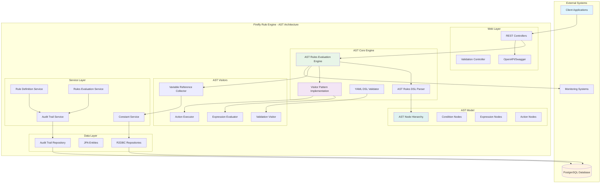
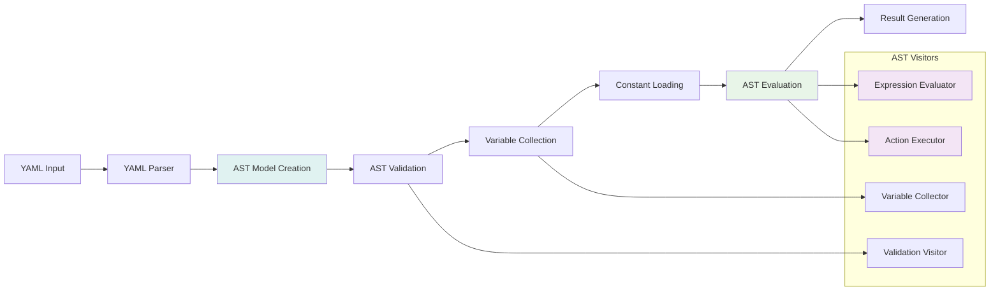
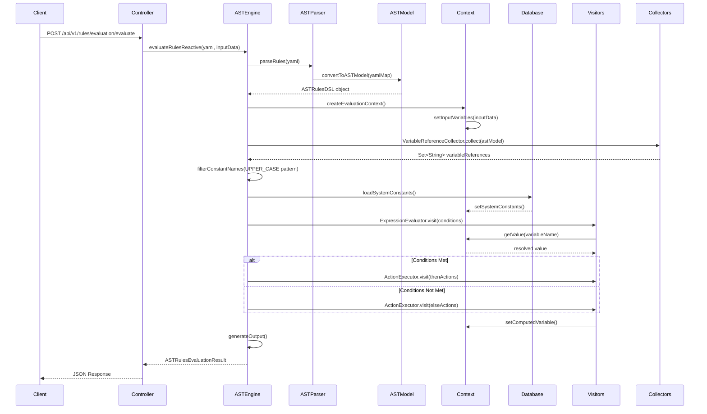
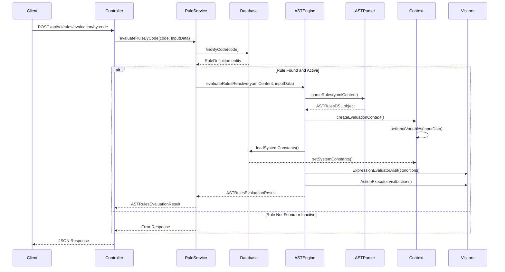
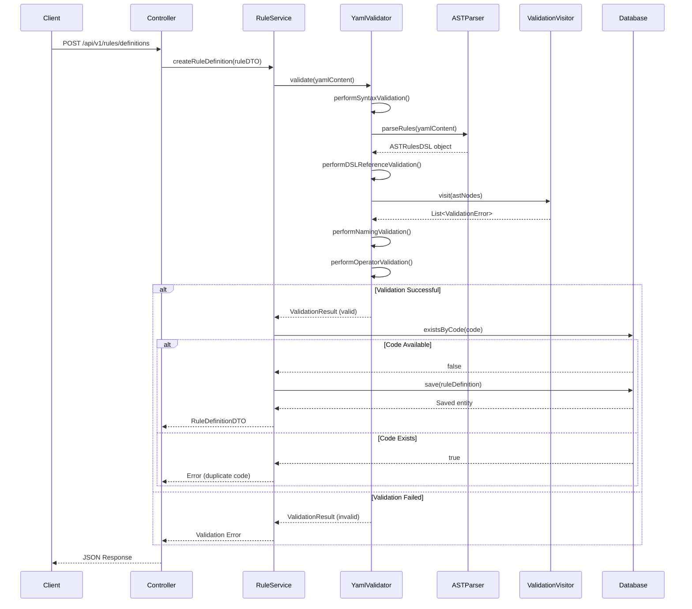
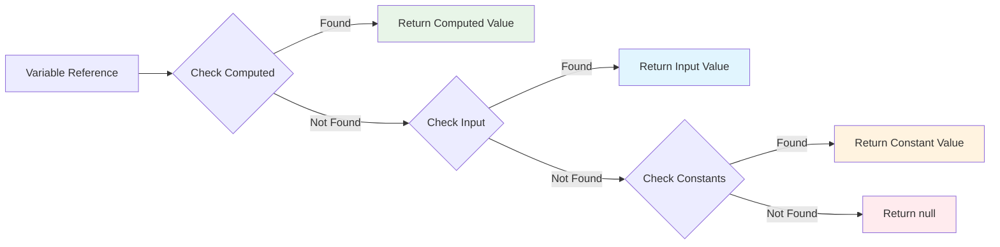
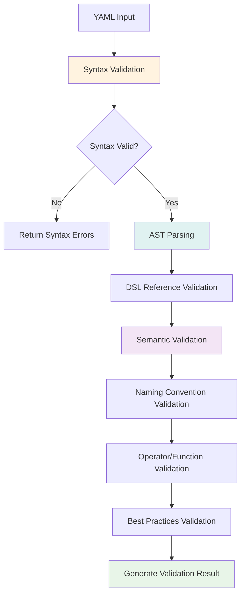
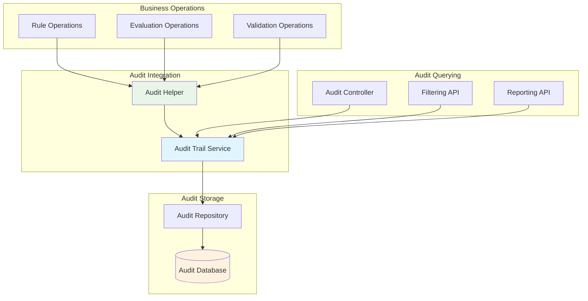

# Architecture Documentation

This document provides a comprehensive overview of the Firefly Rule Engine architecture, including the modern AST-based system design, module structure, data flow, and integration patterns.

## Table of Contents

- [System Overview](#system-overview)
- [AST-Based Architecture](#ast-based-architecture)
- [Module Architecture](#module-architecture)
- [AST Processing Pipeline](#ast-processing-pipeline)
- [Data Flow](#data-flow)
- [Variable Resolution](#variable-resolution)
- [Technology Stack](#technology-stack)
- [Design Patterns](#design-patterns)
- [Core Engine Components](#core-engine-components)
- [Validation Architecture](#validation-architecture)
- [Performance Considerations](#performance-considerations)
- [Audit Trail System](#audit-trail-system)
- [Security Architecture](#security-architecture)

## System Overview

The Firefly Rule Engine is built as a reactive, microservice-ready application using Spring Boot 3 and WebFlux. It features a **modern AST-based (Abstract Syntax Tree) architecture** that completely replaces the legacy string-based evaluation system with structured, type-safe rule processing. The system includes comprehensive **audit trail capabilities** for compliance and monitoring, tracking all rule operations and evaluations with detailed metadata.



## AST-Based Architecture

The Firefly Rule Engine has been completely modernized with an **Abstract Syntax Tree (AST) based architecture** that provides:

### 🏗️ **Structured Rule Processing**
- **Type-Safe Evaluation**: AST nodes provide compile-time type safety
- **Visitor Pattern**: Clean separation of concerns for different operations
- **Extensible Design**: Easy to add new operators, functions, and validation rules
- **Performance Optimized**: Direct AST traversal eliminates string parsing overhead

### 🔄 **Legacy vs. Modern Architecture**

| Aspect | Legacy (String-Based) | Modern (AST-Based) |
|--------|----------------------|-------------------|
| **Parsing** | String manipulation | Structured AST nodes |
| **Evaluation** | Runtime string parsing | Direct AST traversal |
| **Validation** | Basic syntax checking | Comprehensive semantic validation |
| **Type Safety** | Runtime type checking | Compile-time type safety |
| **Performance** | String parsing overhead | Optimized AST operations |
| **Extensibility** | Monolithic evaluators | Visitor pattern modularity |
| **Audit Trail** | Limited logging | Comprehensive audit tracking |
| **Compliance** | Manual tracking | Automated compliance reporting |

## Module Architecture

The system is organized into five distinct Maven modules, each with specific responsibilities:

### 1. common-platform-rule-engine-web
**Purpose**: Web layer and REST API endpoints

**Key Components**:
- `RulesEvaluationController` - Main API for rule evaluation using AST engine
- `RuleDefinitionController` - CRUD operations for YAML DSL rule definitions
- `ValidationController` - Comprehensive YAML DSL validation endpoints
- `ConstantController` - CRUD operations for system constants
- `AuditTrailController` - Audit trail querying and reporting endpoints
- `RuleEngineApplication` - Spring Boot main application
- OpenAPI/Swagger configuration

**Dependencies**:
- `common-platform-rule-engine-core`
- `common-platform-rule-engine-interfaces`

### 2. common-platform-rule-engine-core
**Purpose**: AST-based core business logic and rule evaluation engine

**Key Components**:
- **AST Engine**: `ASTRulesEvaluationEngine` - Pure AST-based rule evaluation orchestrator
- **AST Parser**: `ASTRulesDSLParser` - Converts YAML to structured AST nodes
- **AST Validation**: `YamlDslValidator` - Comprehensive DSL validation using AST
- **AST Visitors**:
  - `ExpressionEvaluator` - Evaluates expressions using visitor pattern
  - `ActionExecutor` - Executes actions using visitor pattern
  - `ValidationVisitor` - Validates AST nodes for semantic correctness
  - `VariableReferenceCollector` - Extracts variable references for constant loading
- **AST Model**: Complete hierarchy of AST node classes
- **Services**: `RuleDefinitionService`, `RulesEvaluationService`, `ConstantService`, `AuditTrailService` - Business logic services
- **Context**: `EvaluationContext` - Maintains state during AST evaluation
- **Audit Integration**: Comprehensive audit trail recording for all operations

**Dependencies**:
- `common-platform-rule-engine-interfaces`
- `common-platform-rule-engine-models`

### 3. common-platform-rule-engine-models
**Purpose**: Data entities and repository interfaces

**Key Components**:
- `Constant` - Entity for system constants
- `RuleDefinition` - Entity for stored YAML DSL rule definitions
- `AuditTrail` - Entity for audit trail records
- `ConstantRepository` - R2DBC repository interface for constants
- `RuleDefinitionRepository` - R2DBC repository interface for rule definitions
- `AuditTrailRepository` - R2DBC repository interface for audit trails
- Database migration scripts (V1__Create_constants_table.sql, V2__Create_rule_definitions_table.sql, V3__Create_audit_trails_table.sql)

**Dependencies**: None (base module)

### 4. common-platform-rule-engine-interfaces
**Purpose**: DTOs, service interfaces, and contracts

**Key Components**:
- `RulesEvaluationRequestDTO` - API request structure
- `RulesEvaluationResponseDTO` - API response structure
- `ConstantDTO` - Data transfer object for constants
- Service interfaces and enums

**Dependencies**: None (base module)

### 5. common-platform-rule-engine-sdk
**Purpose**: Client SDK for integration (future implementation)

**Key Components**:
- Client libraries for Java applications
- Helper utilities for rule management

## AST Processing Pipeline

The AST-based processing pipeline transforms YAML rules through multiple stages:



### AST Node Hierarchy

The system uses a comprehensive AST node hierarchy:

```
ASTNode (abstract base)
├── Expression
│   ├── LiteralExpression (numbers, strings, booleans)
│   ├── VariableExpression (variable references)
│   ├── BinaryExpression (arithmetic operations)
│   ├── FunctionCallExpression (function calls)
│   └── ListExpression (array literals)
├── Condition
│   ├── ComparisonCondition (>, <, ==, etc.)
│   ├── LogicalCondition (AND, OR, NOT)
│   ├── ListCondition (in, not_in)
│   └── ValidationCondition (is_null, is_empty, etc.)
└── Action
    ├── SetAction (variable assignment)
    ├── CalculateAction (arithmetic calculations)
    ├── FunctionCallAction (function execution)
    └── CircuitBreakerAction (execution control)
```

## Data Flow

### Rule Evaluation Flow

#### AST-Based Direct YAML Evaluation


#### AST-Based Stored Rule Evaluation


#### AST-Based Rule Definition Storage Flow


### Variable Resolution Priority & Naming Conventions

The system resolves variables in the following order using **distinct naming patterns**:

1. **Computed Variables** (highest priority - `snake_case`)
   - Created during rule execution with `calculate` or `set` actions
   - Can override input variables
   - Examples: `debt_to_income`, `risk_score`, `final_decision`

2. **Input Variables** (medium priority - `camelCase`)
   - Provided via API request in the `inputData` field
   - Runtime data specific to each evaluation
   - Examples: `creditScore`, `annualIncome`, `employmentYears`

3. **System Constants** (lowest priority - `UPPER_CASE_WITH_UNDERSCORES`)
   - Stored in database and auto-loaded when referenced
   - Follow regex pattern `^[A-Z][A-Z0-9_]*$`
   - Examples: `MIN_CREDIT_SCORE`, `MAX_LOAN_AMOUNT`, `RISK_MULTIPLIER`



## Variable Resolution

### Constant Auto-Detection

The system automatically detects and loads constants from the database using this logic:

```java
private boolean isConstantName(String name) {
    // Constants must match: ^[A-Z][A-Z0-9_]*$
    return name.matches("^[A-Z][A-Z0-9_]*$");
}
```

**Examples**:
- ✅ `MIN_CREDIT_SCORE` - Auto-loaded from database (UPPER_CASE)
- ✅ `MAX_LOAN_AMOUNT_2024` - Auto-loaded from database (UPPER_CASE)
- ❌ `creditScore` - Treated as input variable (camelCase)
- ❌ `debt_to_income` - Treated as computed variable (snake_case)

### Context Management

The `EvaluationContext` maintains three separate maps:

```java
public class EvaluationContext {
    private Map<String, Object> inputVariables;     // From API request
    private Map<String, Object> systemConstants;    // From database
    private Map<String, Object> computedVariables;  // Calculated during execution
    
    public Object getValue(String name) {
        // Priority: Computed > Input > Constants
        if (computedVariables.containsKey(name)) return computedVariables.get(name);
        if (inputVariables.containsKey(name)) return inputVariables.get(name);
        return systemConstants.get(name);
    }
}
```

## Technology Stack

### Core Technologies
- **Java 21** - Latest LTS version with virtual threads
- **Spring Boot 3.x** - Application framework
- **Spring WebFlux** - Reactive web stack
- **R2DBC** - Reactive database connectivity
- **PostgreSQL** - Primary database
- **Maven** - Build and dependency management

### Libraries and Frameworks
- **Jackson** - JSON/YAML processing
- **Lombok** - Code generation
- **MapStruct** - Object mapping
- **OpenAPI 3** - API documentation
- **Reactor** - Reactive programming
- **Flyway** - Database migrations

### Development Tools
- **Docker** - Containerization
- **Swagger UI** - Interactive API documentation
- **Actuator** - Health checks and metrics
- **Prometheus** - Metrics collection

## Design Patterns

### 1. Strategy Pattern
Used in `ConditionEvaluator` for different comparison operators:

```java
switch (operator.toLowerCase()) {
    case "greater_than": return compareGreaterThan(left, right);
    case "equals": return compareEquals(left, right);
    case "in_list": return compareInList(left, right);
    // ... more strategies
}
```

### 2. Builder Pattern
Extensively used for DTOs and domain objects:

```java
RulesEvaluationResult result = RulesEvaluationResult.builder()
    .success(true)
    .conditionResult(conditionResult)
    .outputData(outputData)
    .build();
```

### 3. Template Method Pattern
Used in `ActionExecutor` for different action types:

```java
public void execute(ActionBlock actionBlock, EvaluationContext context) {
    for (Action action : actionBlock.getActions()) {
        executeAction(action, context);  // Template method
    }
}
```

### 4. Factory Pattern
Used in `VariableResolver` for creating different value types:

```java
public Object resolveValue(Object value, EvaluationContext context) {
    if (value instanceof String) return resolveStringValue(value, context);
    if (value instanceof Map) return resolveMapValue(value, context);
    return value;  // Literal value
}
```

### 5. Registry Pattern
Used in both `ConditionEvaluator` and `ActionExecutor` for function registries:

```java
// ConditionEvaluator function registry
switch (functionName.toLowerCase()) {
    case "is_valid_credit_score": return isValidCreditScore(parameters);
    case "is_valid_ssn": return isValidSSN(parameters);
    case "debt_to_income_ratio": return calculateDebtToIncomeRatio(parameters);
    // ... more financial validation functions
}

// ActionExecutor function registry
switch (functionName.toLowerCase()) {
    case "calculate_loan_payment": return calculateLoanPayment(parameters);
    case "calculate_compound_interest": return calculateCompoundInterest(parameters);
    case "format_currency": return formatCurrency(parameters);
    // ... more financial calculation functions
}
```

## Core Engine Components

### AST-Based Evaluation Engine

The `ASTRulesEvaluationEngine` provides pure AST-based rule evaluation with:

**Core Features**:
- **Type-Safe Processing**: Direct AST node traversal eliminates string parsing
- **Visitor Pattern**: Clean separation of evaluation, execution, and validation logic
- **Reactive Support**: Full Mono/Flux integration for non-blocking operations
- **Comprehensive Logging**: Structured JSON logging with operation IDs
- **Error Handling**: Graceful degradation with detailed error reporting

### AST Visitor Pattern Implementation

The system uses the visitor pattern for all AST operations:

#### 1. ExpressionEvaluator Visitor
Evaluates expressions to their values using structured AST traversal:

```java
public class ExpressionEvaluator implements ASTVisitor<Object> {
    @Override
    public Object visitBinaryExpression(BinaryExpression node) {
        Object left = node.getLeft().accept(this);
        Object right = node.getRight().accept(this);
        return evaluateOperation(node.getOperator(), left, right);
    }

    @Override
    public Object visitVariableExpression(VariableExpression node) {
        return context.getValue(node.getVariableName());
    }
}
```

#### 2. ActionExecutor Visitor
Executes actions using structured AST traversal:

```java
public class ActionExecutor implements ASTVisitor<Void> {
    @Override
    public Void visitSetAction(SetAction node) {
        Object value = node.getValue().accept(expressionEvaluator);
        context.setComputedVariable(node.getVariableName(), value);
        return null;
    }

    @Override
    public Void visitCalculateAction(CalculateAction node) {
        Object result = node.getExpression().accept(expressionEvaluator);
        context.setComputedVariable(node.getVariableName(), result);
        return null;
    }
}
```

#### 3. ValidationVisitor
Validates AST nodes for semantic correctness:

```java
public class ValidationVisitor implements ASTVisitor<List<ValidationError>> {
    @Override
    public List<ValidationError> visitVariableExpression(VariableExpression node) {
        List<ValidationError> errors = new ArrayList<>();
        if (!availableVariables.contains(node.getVariableName())) {
            errors.add(new ValidationError("Undefined variable: " + node.getVariableName()));
        }
        return errors;
    }
}
```

### Supported Operations

**Comparison Operators** (26 total):
- **Numeric**: `greater_than`, `less_than`, `at_least`, `at_most`, `between`, `equals`, `not_equals`
- **String**: `contains`, `starts_with`, `ends_with`, `matches`, `not_matches`
- **List**: `in_list`, `not_in_list`, `in`, `not_in`
- **Validation**: `is_null`, `is_not_null`, `is_empty`, `is_not_empty`, `is_numeric`
- **Financial**: `is_credit_score`, `is_ssn`, `is_account_number`, `is_routing_number`

**Built-in Functions**:
- **Financial**: `calculate_loan_payment`, `calculate_debt_ratio`, `debt_to_income_ratio`
- **Utility**: `format_currency`, `log`, `audit_log`

### Circuit Breaker Pattern

The AST engine implements circuit breaker functionality through dedicated action nodes:

```java
@Override
public Void visitCircuitBreakerAction(CircuitBreakerAction node) {
    context.setCircuitBreakerTriggered(true);
    context.setCircuitBreakerMessage(node.getMessage());
    return null; // Stop execution
}
```

**Use Cases**:
- High-risk transaction detection
- Fraud prevention
- System overload protection
- Compliance threshold enforcement

## Validation Architecture

The Firefly Rule Engine features a comprehensive **multi-layer validation architecture** that ensures YAML DSL compliance and quality:

### Validation Pipeline



### Validation Layers

#### 1. Syntax Validation
- **YAML Structure**: Validates basic YAML syntax and structure
- **Required Sections**: Ensures presence of mandatory sections (name, description, inputs, output)
- **Data Types**: Validates correct data types for each section

#### 2. AST-Based Semantic Validation
- **Variable References**: Validates all variable references using `ValidationVisitor`
- **Type Compatibility**: Ensures type compatibility in expressions and conditions
- **Function Calls**: Validates function names and parameter counts
- **Circular Dependencies**: Detects circular references in variable calculations

#### 3. DSL Reference Compliance
- **Complete Coverage**: Validates against the full YAML DSL Reference specification
- **Operator Support**: Ensures all operators are documented and supported
- **Function Registry**: Validates against built-in function registry
- **Syntax Patterns**: Enforces documented syntax patterns

#### 4. Naming Convention Validation
- **Input Variables**: Enforces `camelCase` naming (e.g., `creditScore`, `annualIncome`)
- **System Constants**: Validates `UPPER_CASE_WITH_UNDERSCORES` pattern (e.g., `MIN_CREDIT_SCORE`)
- **Computed Variables**: Enforces `snake_case` naming (e.g., `debt_to_income`, `final_score`)

#### 5. Best Practices Validation
- **Performance Optimization**: Suggests improvements for complex expressions
- **Code Quality**: Recommends better variable names and structure
- **Maintainability**: Identifies potential maintenance issues

### Validation Result Structure

```java
public class ValidationResult {
    private ValidationStatus status;           // VALID, WARNING, ERROR, CRITICAL_ERROR
    private ValidationSummary summary;         // Issue counts and quality score (0-100)
    private ValidationIssues issues;          // Categorized issues by type
    private List<ValidationSuggestion> suggestions; // Improvement recommendations
    private ValidationMetadata metadata;      // Validation process metadata
}
```

### Integration Points

- **ValidationController**: REST API endpoints for standalone validation
- **RuleDefinitionService**: Automatic validation before rule storage
- **YamlDslValidator**: Central orchestrator for all validation components
- **AST Visitors**: Deep semantic validation using visitor pattern

## Performance Considerations

### 1. AST-Based Performance Optimizations
- **Direct AST Traversal**: Eliminates string parsing overhead during evaluation
- **Type-Safe Operations**: Compile-time type checking reduces runtime validation
- **Visitor Pattern Efficiency**: Single-pass AST traversal for multiple operations
- **Structured Memory Layout**: AST nodes provide better memory locality

### 2. Reactive Architecture
- **Non-blocking I/O**: WebFlux for high-throughput processing
- **Reactive Database Access**: R2DBC for non-blocking database operations
- **Parallel Rule Processing**: Concurrent evaluation of multiple rules
- **Backpressure Handling**: Reactive streams manage load automatically

### 3. Connection Pooling
```yaml
spring:
  r2dbc:
    pool:
      initial-size: 5
      max-size: 10
      max-idle-time: 30m
      max-acquire-time: 60s
      max-life-time: 1800s
```

### 4. Caching Strategy
- **Constant Caching**: System constants loaded once per evaluation context
- **AST Caching**: Parsed AST models can be cached for frequently used rules
- **Connection Pooling**: Efficient database connection reuse
- **Variable Resolution**: Priority-based maps for O(1) variable lookup

### 5. Memory Management
- **Immutable AST Nodes**: Thread-safe and memory-efficient
- **Context Isolation**: Separate evaluation contexts prevent memory leaks
- **Efficient Collections**: ConcurrentHashMap for thread-safe variable storage
- **Minimal Object Creation**: Reuse of visitor instances and evaluation contexts

### 6. AST-Specific Optimizations
- **Single-Pass Parsing**: YAML to AST conversion in one pass
- **Lazy Evaluation**: Expressions evaluated only when needed
- **Short-Circuit Logic**: Logical operators stop evaluation early when possible
- **Optimized Visitor Dispatch**: Direct method calls instead of reflection

## Audit Trail System

The Firefly Rule Engine includes a comprehensive audit trail system that tracks all rule operations for compliance, monitoring, and debugging purposes.

### 🔍 **Audit Trail Features**

#### **1. Comprehensive Operation Tracking**
- **Rule Definition Operations**: Create, update, delete, activate/deactivate
- **Rule Evaluations**: Direct YAML, stored rule by code, plain YAML
- **Validation Operations**: DSL validation requests and results
- **System Operations**: Constant management, configuration changes

#### **2. Detailed Audit Records**
Each audit trail record captures:
- **Operation Metadata**: Type, timestamp, user, IP address, user agent
- **Request/Response Data**: Full request and response payloads as JSON
- **Performance Metrics**: Execution time, status codes, success/failure
- **Business Context**: Rule codes, entity IDs, correlation IDs
- **Error Information**: Detailed error messages and stack traces
- **Custom Metadata**: Extensible metadata for business-specific information

#### **3. Reactive Audit Integration**
The audit system is fully integrated with the reactive architecture:
- **Non-blocking Operations**: All audit operations use reactive patterns
- **Proper Error Handling**: Audit failures don't affect business operations
- **Backpressure Support**: Handles high-volume audit scenarios gracefully

### 📊 **Audit Trail Architecture**



### 🎯 **Audit Event Types**

| Event Type | Description | Tracked Data |
|------------|-------------|--------------|
| `RULE_DEFINITION_CREATE` | New rule definition created | Rule metadata, YAML content, validation results |
| `RULE_DEFINITION_UPDATE` | Existing rule definition updated | Changes made, version info, validation results |
| `RULE_DEFINITION_DELETE` | Rule definition deleted | Rule metadata, deletion reason |
| `RULE_EVALUATION_DIRECT` | Direct YAML evaluation | Input data, evaluation results, performance metrics |
| `RULE_EVALUATION_BY_CODE` | Stored rule evaluation by code | Rule code, input data, results, rule metadata |
| `RULE_EVALUATION_PLAIN` | Plain YAML evaluation | YAML content, input data, results |
| `DSL_VALIDATION` | YAML DSL validation | Validation results, errors, suggestions |

### 🔧 **Audit Trail API**

#### **Query Audit Trails**
```http
POST /api/v1/audit/trails
Content-Type: application/json

{
  "operationType": "RULE_EVALUATION_DIRECT",
  "userId": "john.doe@company.com",
  "startDate": "2025-01-01T00:00:00Z",
  "endDate": "2025-01-31T23:59:59Z",
  "page": 0,
  "size": 20,
  "sortBy": "createdAt",
  "sortDirection": "DESC"
}
```

#### **Get Audit Trail by ID**
```http
GET /api/v1/audit/trails/{auditId}
```

#### **Get Recent Trails for Entity**
```http
GET /api/v1/audit/trails/entity/{entityId}?limit=10
```

### 📈 **Compliance and Reporting**

#### **Regulatory Compliance**
- **SOX Compliance**: Complete audit trail for financial rule changes
- **GDPR Compliance**: User activity tracking with data protection
- **PCI DSS**: Secure audit logging for payment processing rules
- **Basel III**: Risk management rule audit trails

#### **Business Intelligence**
- **Rule Usage Analytics**: Track which rules are evaluated most frequently
- **Performance Monitoring**: Identify slow-performing rules and optimizations
- **Error Analysis**: Pattern detection in rule failures and validation errors
- **User Activity**: Monitor rule management activities by user and department

#### **Operational Insights**
- **System Health**: Monitor rule engine performance and reliability
- **Capacity Planning**: Analyze usage patterns for scaling decisions
- **Security Monitoring**: Detect unusual access patterns or potential security issues
- **Change Management**: Track rule evolution and impact analysis

### 🔒 **Audit Trail Security**

#### **Data Protection**
- **Sensitive Data Masking**: Automatic masking of PII in audit records
- **Encryption at Rest**: Audit data encrypted in database storage
- **Access Control**: Role-based access to audit trail data
- **Retention Policies**: Configurable retention periods for compliance

#### **Integrity Assurance**
- **Immutable Records**: Audit trails cannot be modified after creation
- **Checksums**: Data integrity verification for audit records
- **Audit of Audits**: Meta-auditing for audit system operations
- **Backup and Recovery**: Secure backup strategies for audit data

## Security Architecture

### 1. Input Validation
- YAML DSL validation during parsing
- DTO validation with Bean Validation
- SQL injection prevention with parameterized queries

### 2. Error Handling
- Graceful degradation for missing constants
- Circuit breaker pattern for external dependencies
- Comprehensive logging for audit trails

### 3. Database Security
- R2DBC with prepared statements
- Connection encryption with SSL
- Database user with minimal privileges

### 4. API Security (Future)
- JWT token authentication
- Rate limiting per client
- Request/response encryption

This architecture provides a solid foundation for a scalable, maintainable, and high-performance rule engine suitable for financial services applications.
