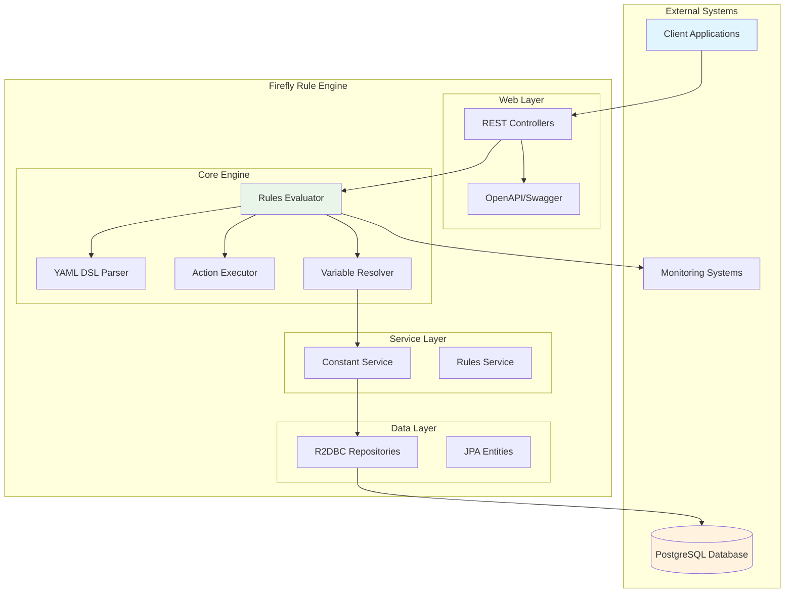
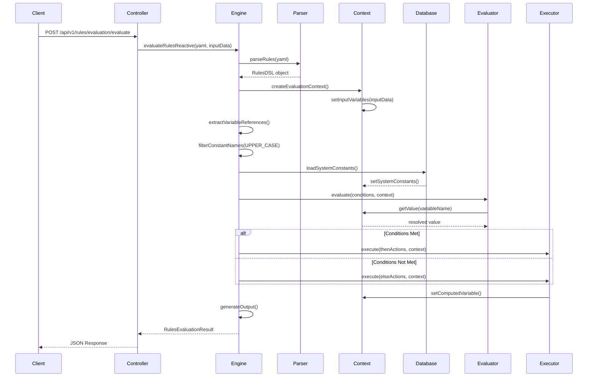
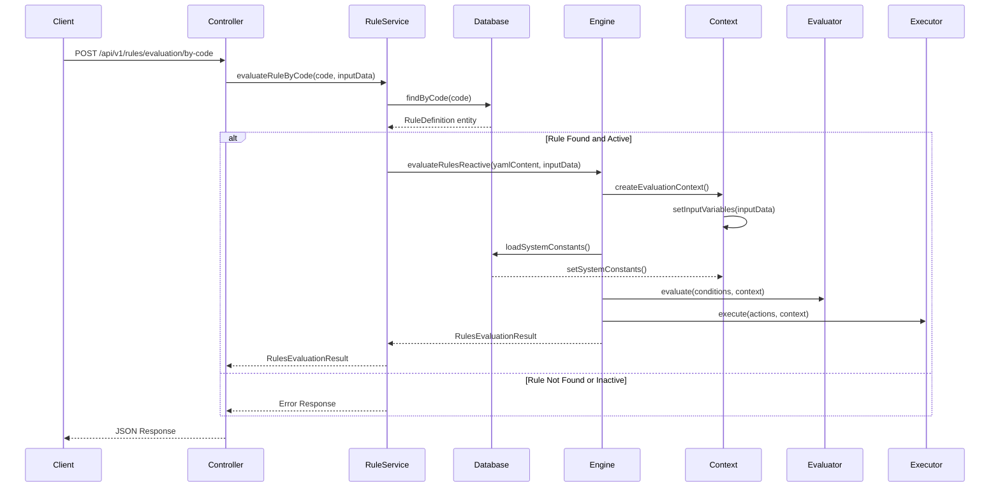
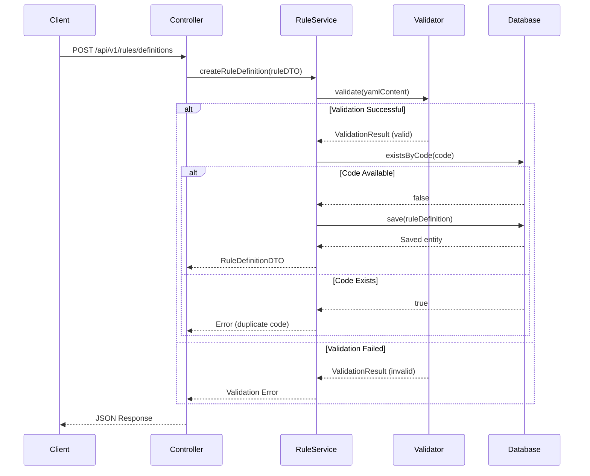
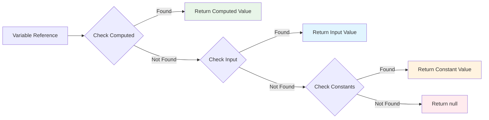

# Architecture Documentation

This document provides a comprehensive overview of the Firefly Rule Engine architecture, including system design, module structure, data flow, and integration patterns.

## Table of Contents

- [System Overview](#system-overview)
- [Module Architecture](#module-architecture)
- [Data Flow](#data-flow)
- [Variable Resolution](#variable-resolution)
- [Technology Stack](#technology-stack)
- [Design Patterns](#design-patterns)
- [Core Engine Components](#core-engine-components)
- [Performance Considerations](#performance-considerations)
- [Security Architecture](#security-architecture)

## System Overview

The Firefly Rule Engine is built as a reactive, microservice-ready application using Spring Boot 3 and WebFlux. It follows a layered architecture with clear separation of concerns.



## Module Architecture

The system is organized into five distinct Maven modules, each with specific responsibilities:

### 1. common-platform-rule-engine-web
**Purpose**: Web layer and REST API endpoints

**Key Components**:
- `RulesEvaluationController` - Main API for rule evaluation
- `RuleDefinitionController` - CRUD operations for YAML DSL rule definitions
- `ValidationController` - YAML DSL validation endpoints
- `ConstantController` - CRUD operations for system constants
- `RuleEngineApplication` - Spring Boot main application
- OpenAPI/Swagger configuration

**Dependencies**:
- `common-platform-rule-engine-core`
- `common-platform-rule-engine-interfaces`

### 2. common-platform-rule-engine-core
**Purpose**: Core business logic and rule evaluation engine

**Key Components**:
- `RulesEvaluationEngine` - Main orchestrator for rule evaluation
- `RulesDSLParser` - YAML parsing and validation
- `YamlDslValidator` - Comprehensive YAML DSL validation
- `RuleDefinitionService` - Service for managing stored rule definitions
- `ConditionEvaluator` - Evaluates rule conditions with 26 operators and 10 financial validation functions
- `ActionExecutor` - Executes rule actions with 15 financial calculation functions and circuit breaker support
- `ArithmeticEvaluator` - Handles mathematical expressions and calculations
- `VariableResolver` - Resolves variables and constants with priority-based lookup
- `EvaluationContext` - Maintains state during evaluation with separate variable namespaces

**Dependencies**:
- `common-platform-rule-engine-interfaces`
- `common-platform-rule-engine-models`

### 3. common-platform-rule-engine-models
**Purpose**: Data entities and repository interfaces

**Key Components**:
- `Constant` - Entity for system constants
- `RuleDefinition` - Entity for stored YAML DSL rule definitions
- `ConstantRepository` - R2DBC repository interface for constants
- `RuleDefinitionRepository` - R2DBC repository interface for rule definitions
- Database migration scripts (V1__Create_constants_table.sql, V2__Create_rule_definitions_table.sql)

**Dependencies**: None (base module)

### 4. common-platform-rule-engine-interfaces
**Purpose**: DTOs, service interfaces, and contracts

**Key Components**:
- `RulesEvaluationRequestDTO` - API request structure
- `RulesEvaluationResponseDTO` - API response structure
- `ConstantDTO` - Data transfer object for constants
- Service interfaces and enums

**Dependencies**: None (base module)

### 5. common-platform-rule-engine-sdk
**Purpose**: Client SDK for integration (future implementation)

**Key Components**:
- Client libraries for Java applications
- Helper utilities for rule management

## Data Flow

### Rule Evaluation Flow

#### Direct YAML Evaluation


#### Stored Rule Evaluation


#### Rule Definition Storage Flow


### Variable Resolution Priority & Naming Conventions

The system resolves variables in the following order using **distinct naming patterns**:

1. **Computed Variables** (highest priority - `snake_case`)
   - Created during rule execution with `calculate` or `set` actions
   - Can override input variables
   - Examples: `debt_to_income`, `risk_score`, `final_decision`

2. **Input Variables** (medium priority - `camelCase`)
   - Provided via API request in the `inputData` field
   - Runtime data specific to each evaluation
   - Examples: `creditScore`, `annualIncome`, `employmentYears`

3. **System Constants** (lowest priority - `UPPER_CASE_WITH_UNDERSCORES`)
   - Stored in database and auto-loaded when referenced
   - Follow regex pattern `^[A-Z][A-Z0-9_]*$`
   - Examples: `MIN_CREDIT_SCORE`, `MAX_LOAN_AMOUNT`, `RISK_MULTIPLIER`



## Variable Resolution

### Constant Auto-Detection

The system automatically detects and loads constants from the database using this logic:

```java
private boolean isConstantName(String name) {
    // Constants must match: ^[A-Z][A-Z0-9_]*$
    return name.matches("^[A-Z][A-Z0-9_]*$");
}
```

**Examples**:
- ✅ `MIN_CREDIT_SCORE` - Auto-loaded from database (UPPER_CASE)
- ✅ `MAX_LOAN_AMOUNT_2024` - Auto-loaded from database (UPPER_CASE)
- ❌ `creditScore` - Treated as input variable (camelCase)
- ❌ `debt_to_income` - Treated as computed variable (snake_case)

### Context Management

The `EvaluationContext` maintains three separate maps:

```java
public class EvaluationContext {
    private Map<String, Object> inputVariables;     // From API request
    private Map<String, Object> systemConstants;    // From database
    private Map<String, Object> computedVariables;  // Calculated during execution
    
    public Object getValue(String name) {
        // Priority: Computed > Input > Constants
        if (computedVariables.containsKey(name)) return computedVariables.get(name);
        if (inputVariables.containsKey(name)) return inputVariables.get(name);
        return systemConstants.get(name);
    }
}
```

## Technology Stack

### Core Technologies
- **Java 21** - Latest LTS version with virtual threads
- **Spring Boot 3.x** - Application framework
- **Spring WebFlux** - Reactive web stack
- **R2DBC** - Reactive database connectivity
- **PostgreSQL** - Primary database
- **Maven** - Build and dependency management

### Libraries and Frameworks
- **Jackson** - JSON/YAML processing
- **Lombok** - Code generation
- **MapStruct** - Object mapping
- **OpenAPI 3** - API documentation
- **Reactor** - Reactive programming
- **Flyway** - Database migrations

### Development Tools
- **Docker** - Containerization
- **Swagger UI** - Interactive API documentation
- **Actuator** - Health checks and metrics
- **Prometheus** - Metrics collection

## Design Patterns

### 1. Strategy Pattern
Used in `ConditionEvaluator` for different comparison operators:

```java
switch (operator.toLowerCase()) {
    case "greater_than": return compareGreaterThan(left, right);
    case "equals": return compareEquals(left, right);
    case "in_list": return compareInList(left, right);
    // ... more strategies
}
```

### 2. Builder Pattern
Extensively used for DTOs and domain objects:

```java
RulesEvaluationResult result = RulesEvaluationResult.builder()
    .success(true)
    .conditionResult(conditionResult)
    .outputData(outputData)
    .build();
```

### 3. Template Method Pattern
Used in `ActionExecutor` for different action types:

```java
public void execute(ActionBlock actionBlock, EvaluationContext context) {
    for (Action action : actionBlock.getActions()) {
        executeAction(action, context);  // Template method
    }
}
```

### 4. Factory Pattern
Used in `VariableResolver` for creating different value types:

```java
public Object resolveValue(Object value, EvaluationContext context) {
    if (value instanceof String) return resolveStringValue(value, context);
    if (value instanceof Map) return resolveMapValue(value, context);
    return value;  // Literal value
}
```

### 5. Registry Pattern
Used in both `ConditionEvaluator` and `ActionExecutor` for function registries:

```java
// ConditionEvaluator function registry
switch (functionName.toLowerCase()) {
    case "is_valid_credit_score": return isValidCreditScore(parameters);
    case "is_valid_ssn": return isValidSSN(parameters);
    case "debt_to_income_ratio": return calculateDebtToIncomeRatio(parameters);
    // ... more financial validation functions
}

// ActionExecutor function registry
switch (functionName.toLowerCase()) {
    case "calculate_loan_payment": return calculateLoanPayment(parameters);
    case "calculate_compound_interest": return calculateCompoundInterest(parameters);
    case "format_currency": return formatCurrency(parameters);
    // ... more financial calculation functions
}
```

## Core Engine Components

### Condition Evaluation Engine

The `ConditionEvaluator` provides comprehensive condition evaluation with:

**Comparison Operators** (26 total):
- **Numeric**: `>`, `<`, `>=`, `<=`, `==`, `!=`, `between`, `not_between`
- **String**: `contains`, `starts_with`, `ends_with`, `matches`, `not_matches`
- **List**: `in_list`, `not_in_list`
- **Validation**: `is_null`, `is_not_null`, `is_empty`, `is_not_empty`, `is_numeric`, `is_email`, `is_phone`
- **Financial**: `is_positive`, `is_negative`, `is_zero`, `is_percentage`, `is_currency`, `is_credit_score`, `is_ssn`, `is_account_number`, `is_routing_number`, `is_business_day`, `is_weekend`, `age_at_least`, `age_less_than`

**Function Registry** (10 financial validation functions):
- `is_valid_credit_score`, `is_valid_ssn`, `is_valid_account`, `is_valid_routing`
- `is_business_day`, `age_meets_requirement`, `debt_to_income_ratio`
- `credit_utilization`, `loan_to_value`, `payment_history_score`

### Action Execution Engine

The `ActionExecutor` supports multiple action types with enhanced capabilities:

**Action Types**:
- **Variable Assignment**: `set variable to value`
- **Arithmetic Operations**: `calculate expression as variable`
- **Function Calls**: `call function with parameters`
- **Circuit Breaker**: `circuit_breaker "message"` (stops execution)
- **List Operations**: `append`, `prepend`, `remove`
- **Conditional Actions**: `if condition then action`

**Function Registry** (15 financial calculation functions):
- **Loan Calculations**: `calculate_loan_payment`, `calculate_compound_interest`, `calculate_amortization`
- **Credit Scoring**: `calculate_credit_score`, `calculate_risk_score`
- **Financial Ratios**: `calculate_debt_ratio`, `calculate_ltv`, `calculate_apr`
- **Formatting**: `format_currency`, `format_percentage`
- **Utilities**: `generate_account_number`, `generate_transaction_id`, `audit_log`, `send_notification`

### Circuit Breaker Pattern

The engine implements circuit breaker functionality for risk management:

```java
// Circuit breaker action stops rule execution immediately
if (action.startsWith("circuit_breaker")) {
    String message = extractCircuitBreakerMessage(action);
    context.setCircuitBreakerTriggered(true);
    context.setCircuitBreakerMessage(message);
    return; // Stop execution
}
```

**Use Cases**:
- High-risk transaction detection
- Fraud prevention
- System overload protection
- Compliance threshold enforcement

## Performance Considerations

### 1. Reactive Architecture
- Non-blocking I/O with WebFlux
- Reactive database access with R2DBC
- Parallel processing of multiple rules

### 2. Connection Pooling
```yaml
spring:
  r2dbc:
    pool:
      initial-size: 5
      max-size: 10
      max-idle-time: 30m
```

### 3. Caching Strategy
- Constants are loaded once per evaluation
- Parsed rules can be cached (future enhancement)
- Database connection pooling

### 4. Memory Management
- Immutable DTOs where possible
- Efficient variable resolution with priority maps
- Minimal object creation during evaluation

## Security Architecture

### 1. Input Validation
- YAML DSL validation during parsing
- DTO validation with Bean Validation
- SQL injection prevention with parameterized queries

### 2. Error Handling
- Graceful degradation for missing constants
- Circuit breaker pattern for external dependencies
- Comprehensive logging for audit trails

### 3. Database Security
- R2DBC with prepared statements
- Connection encryption with SSL
- Database user with minimal privileges

### 4. API Security (Future)
- JWT token authentication
- Rate limiting per client
- Request/response encryption

This architecture provides a solid foundation for a scalable, maintainable, and high-performance rule engine suitable for financial services applications.
