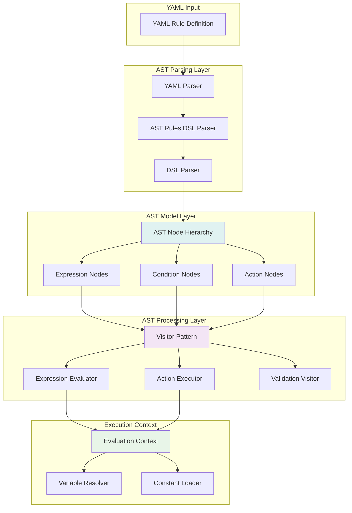

# Developer Guide

This guide provides comprehensive instructions for setting up, developing, testing, and deploying the Firefly Rule Engine.

## Table of Contents

- [Prerequisites](#prerequisites)
- [Development Environment Setup](#development-environment-setup)
- [Building the Project](#building-the-project)
- [Running the Application](#running-the-application)
- [Testing](#testing)
- [Database Setup](#database-setup)
- [IDE Configuration](#ide-configuration)
- [Debugging](#debugging)
- [AST System Deep Dive](#ast-system-deep-dive)
- [Extending the AST System](#extending-the-ast-system)
- [Contributing](#contributing)

## Prerequisites

### Required Software

| Software | Version | Purpose |
|----------|---------|---------|
| **Java** | 21+ | Runtime and compilation |
| **Maven** | 3.8+ | Build and dependency management |
| **PostgreSQL** | 12+ | Database for constants storage |
| **Docker** | 20+ | Containerization (optional) |
| **Git** | 2.30+ | Version control |

### Recommended Tools

- **IntelliJ IDEA** or **Eclipse** - IDE with Spring Boot support
- **Postman** or **curl** - API testing
- **DBeaver** or **pgAdmin** - Database management
- **Docker Compose** - Multi-container orchestration

## Development Environment Setup

### 1. Clone the Repository

```bash
git clone https://github.com/firefly-oss/common-platform-rule-engine.git
cd common-platform-rule-engine
```

### 2. Set Up PostgreSQL Database

The application uses PostgreSQL with R2DBC for reactive database access. The database stores system constants and YAML DSL rule definitions.

#### Database Schema Overview

The application includes two main tables:
- **`constants`** - System constants used in rule evaluation (e.g., MIN_CREDIT_SCORE, MAX_LOAN_AMOUNT)
- **`rule_definitions`** - Stored YAML DSL rule definitions with versioning and metadata

Database migrations are automatically applied on startup using Flyway.

#### Option A: Local PostgreSQL Installation

```bash
# Install PostgreSQL (Ubuntu/Debian)
sudo apt update
sudo apt install postgresql postgresql-contrib

# Create database and user
sudo -u postgres psql
CREATE DATABASE firefly_rules;
CREATE USER firefly_user WITH PASSWORD 'firefly_password';
GRANT ALL PRIVILEGES ON DATABASE firefly_rules TO firefly_user;
\q
```

#### Option B: Docker PostgreSQL

```bash
# Run PostgreSQL in Docker
docker run --name firefly-postgres \
  -e POSTGRES_DB=firefly_rules \
  -e POSTGRES_USER=firefly_user \
  -e POSTGRES_PASSWORD=firefly_password \
  -p 5432:5432 \
  -d postgres:15
```

### 3. Configure Environment Variables

Create a `.env` file in the project root:

```bash
# Database Configuration
DB_HOST=localhost
DB_PORT=5432
DB_NAME=firefly_rules
DB_USERNAME=firefly_user
DB_PASSWORD=firefly_password
DB_SSL_MODE=disable

# Application Configuration
SERVER_PORT=8080
SERVER_ADDRESS=localhost

# Logging Configuration
LOGGING_LEVEL_ROOT=INFO
LOGGING_LEVEL_FIREFLY=DEBUG
```

### 4. Load Environment Variables

```bash
# Linux/macOS
export $(cat .env | xargs)

# Windows (PowerShell)
Get-Content .env | ForEach-Object {
    $name, $value = $_.split('=')
    Set-Content env:\$name $value
}
```

## Building the Project

### 1. Clean and Compile

```bash
# Clean previous builds
mvn clean

# Compile all modules
mvn compile

# Package without running tests
mvn package -DskipTests

# Full build with tests
mvn clean install
```

### 2. Module-Specific Builds

```bash
# Build specific module
cd common-platform-rule-engine-core
mvn clean install

# Build with specific profile
mvn clean install -Pdev
```

### 3. Build Verification

```bash
# Verify build artifacts
ls -la common-platform-rule-engine-web/target/
# Should see: common-platform-rule-engine-web-1.0.0-SNAPSHOT.jar
```

## Running the Application

### 1. Development Mode

```bash
# Run with Maven (auto-reload enabled)
cd common-platform-rule-engine-web
mvn spring-boot:run

# Run with specific profile
mvn spring-boot:run -Dspring-boot.run.profiles=dev

# Run with JVM arguments
mvn spring-boot:run -Dspring-boot.run.jvmArguments="-Xmx1024m -Xdebug"
```

### 2. Production Mode

```bash
# Build JAR
mvn clean package

# Run JAR
java -jar common-platform-rule-engine-web/target/common-platform-rule-engine-web-1.0.0-SNAPSHOT.jar

# Run with specific profile
java -jar -Dspring.profiles.active=prod common-platform-rule-engine-web-1.0.0-SNAPSHOT.jar
```

### 3. Docker Mode

```bash
# Build Docker image
docker build -t firefly-rule-engine .

# Run container
docker run -p 8080:8080 \
  -e DB_HOST=host.docker.internal \
  -e DB_USERNAME=firefly_user \
  -e DB_PASSWORD=firefly_password \
  firefly-rule-engine
```

### 4. Verify Application Startup

```bash
# Check health endpoint
curl http://localhost:8080/actuator/health

# Check API documentation
open http://localhost:8080/swagger-ui.html
```

## Testing

### 1. Unit Tests

```bash
# Run all unit tests
mvn test

# Run tests for specific module
cd common-platform-rule-engine-core
mvn test

# Run specific test class
mvn test -Dtest=RulesEvaluationEngineTest

# Run specific test method
mvn test -Dtest=RulesEvaluationEngineTest#testEvaluateSimplifiedDSL
```

### 2. Integration Tests

```bash
# Run integration tests
mvn verify

# Run with test database
mvn verify -Dspring.profiles.active=test

# Generate test coverage report
mvn jacoco:report
open target/site/jacoco/index.html
```

### 3. Test Categories

| Test Type | Location | Purpose |
|-----------|----------|---------|
| Unit Tests | `src/test/java/**/*Test.java` | Test individual components |
| Integration Tests | `src/test/java/**/*IntegrationTest.java` | Test component interactions |
| API Tests | `src/test/java/**/controllers/*Test.java` | Test REST endpoints |

### 4. Test Data Management

```bash
# Reset test database
mvn flyway:clean flyway:migrate -Dspring.profiles.active=test

# Load test data
mvn exec:java -Dexec.mainClass="com.firefly.rules.TestDataLoader"
```

## Database Setup

### 1. Database Migrations

```bash
# Run migrations manually
mvn flyway:migrate

# Check migration status
mvn flyway:info

# Clean database (development only)
mvn flyway:clean
```

### 2. Migration Files

Location: `common-platform-rule-engine-models/src/main/resources/db/migration/`

```
V1__Create_constants_table.sql       # System constants storage
V2__Create_rule_definitions_table.sql # YAML DSL rule definitions storage
```

#### V1__Create_constants_table.sql
Creates the `constants` table for storing system constants used in rule evaluation.

#### V2__Create_rule_definitions_table.sql
Creates the `rule_definitions` table for storing YAML DSL rule definitions with:
- Unique code-based identification
- Version tracking and metadata
- Active/inactive status management
- Full YAML content storage
- Audit fields (created_by, updated_by, timestamps)

### 3. Test Database Setup

```yaml
# application-test.yaml
spring:
  r2dbc:
    url: r2dbc:h2:mem:///testdb
  flyway:
    url: jdbc:h2:mem:testdb
```

## Working with YAML DSL Storage

### 1. Development Workflow

#### Creating Rule Definitions

```bash
# 1. Create and validate YAML DSL
curl -X POST http://localhost:8080/api/v1/rules/definitions/validate \
  -H "Content-Type: text/plain" \
  -d 'name: "Credit Scoring"
description: "Basic credit assessment"

inputs:
  - creditScore
  - annualIncome

when:
  - creditScore at_least MIN_CREDIT_SCORE
  - annualIncome at_least MIN_ANNUAL_INCOME

then:
  - set is_eligible to true
  - set approval_tier to "STANDARD"

else:
  - set is_eligible to false
  - set approval_tier to "DECLINED"

output:
  is_eligible: boolean
  approval_tier: text'

# 2. Store validated rule definition
curl -X POST http://localhost:8080/api/v1/rules/definitions \
  -H "Content-Type: application/json" \
  -d '{
    "code": "credit_scoring_v1",
    "name": "Credit Scoring Rule v1",
    "description": "Basic credit scoring for loan applications",
    "yamlContent": "...",
    "version": "1.0",
    "isActive": true,
    "tags": "credit,scoring,loan"
  }'
```

#### Testing Stored Rules

```bash
# Evaluate by code
curl -X POST http://localhost:8080/api/v1/rules/evaluate/by-code \
  -H "Content-Type: application/json" \
  -d '{
    "ruleDefinitionCode": "credit_scoring_v1",
    "inputData": {
      "creditScore": 720,
      "annualIncome": 75000
    }
  }'

# Evaluate by ID
curl -X POST http://localhost:8080/api/v1/rules/evaluate/by-id \
  -H "Content-Type: application/json" \
  -d '{
    "ruleDefinitionId": "123e4567-e89b-12d3-a456-426614174000",
    "inputData": {
      "creditScore": 720,
      "annualIncome": 75000
    }
  }'
```

### 2. Best Practices

#### Rule Definition Management
- Use semantic versioning for rule versions (e.g., "1.0.0", "1.1.0")
- Include descriptive tags for easy categorization and search
- Always validate YAML DSL before storing
- Use meaningful codes that reflect the rule's purpose
- Set `isActive: false` for deprecated rules instead of deleting

#### Development Tips
- Test rules with various input scenarios before deployment
- Use the validation endpoint during development to catch issues early
- Leverage filtering and pagination for large rule sets
- Monitor rule evaluation performance and optimize as needed

## IDE Configuration

### IntelliJ IDEA Setup

1. **Import Project**
   - File → Open → Select `pom.xml`
   - Import as Maven project

2. **Configure JDK**
   - File → Project Structure → Project → SDK: Java 21

3. **Enable Annotation Processing**
   - Settings → Build → Compiler → Annotation Processors
   - Enable annotation processing

4. **Install Plugins**
   - Lombok Plugin
   - Spring Boot Plugin
   - YAML/Ansible Support

5. **Run Configurations**
   ```
   Main Class: com.firefly.rules.web.RuleEngineApplication
   VM Options: -Dspring.profiles.active=dev
   Environment Variables: DB_HOST=localhost;DB_USERNAME=firefly_user
   ```

### Eclipse Setup

1. **Import Maven Project**
   - File → Import → Existing Maven Projects

2. **Configure Build Path**
   - Right-click project → Properties → Java Build Path
   - Add JRE 21

3. **Enable Lombok**
   - Download lombok.jar
   - Run: `java -jar lombok.jar`
   - Point to Eclipse installation

## Debugging

### 1. Application Debugging

```bash
# Enable debug mode
export JAVA_OPTS="-Xdebug -Xrunjdwp:transport=dt_socket,server=y,suspend=n,address=5005"
mvn spring-boot:run

# Or with JAR
java -Xdebug -Xrunjdwp:transport=dt_socket,server=y,suspend=n,address=5005 \
  -jar common-platform-rule-engine-web-1.0.0-SNAPSHOT.jar
```

### 2. Database Debugging

```bash
# Enable SQL logging
export LOGGING_LEVEL_ORG_SPRINGFRAMEWORK_R2DBC=DEBUG

# Monitor database connections
export LOGGING_LEVEL_IO_R2DBC_POOL=DEBUG
```

### 3. Rule Evaluation Debugging

```yaml
# Enable detailed rule logging
logging:
  level:
    com.firefly.rules.core.dsl.evaluation: DEBUG
    com.firefly.rules.core.utils.JsonLogger: TRACE
```

### 4. Common Issues

| Issue | Symptom | Solution |
|-------|---------|----------|
| Database Connection | `Connection refused` | Check PostgreSQL is running |
| Port Conflict | `Port 8080 already in use` | Change `SERVER_PORT` or kill process |
| Memory Issues | `OutOfMemoryError` | Increase heap size: `-Xmx2g` |
| Lombok Issues | `Cannot resolve symbol` | Install Lombok plugin |

## Contributing

### 1. Code Style

```bash
# Format code with Maven
mvn spotless:apply

# Check code style
mvn spotless:check
```

### 2. Commit Guidelines

```bash
# Commit message format
git commit -m "feat(core): add support for nested conditions

- Implement nested condition evaluation
- Add tests for complex rule scenarios
- Update documentation

Closes #123"
```

### 3. Pull Request Process

1. Create feature branch: `git checkout -b feature/new-feature`
2. Make changes and add tests
3. Run full test suite: `mvn clean verify`
4. Update documentation if needed
5. Submit pull request with description

### 4. Code Quality Gates

- All tests must pass
- Code coverage > 80%
- No SonarQube critical issues
- Documentation updated
- Changelog entry added

## AST System Deep Dive

The Firefly Rule Engine is built on a modern **Abstract Syntax Tree (AST) architecture** that provides type-safe, extensible, and high-performance rule processing. This section provides a comprehensive guide to understanding and extending the AST system.

### 🏗️ **AST Architecture Overview**

The AST system replaces traditional string-based rule evaluation with structured, type-safe processing:



### 🌳 **AST Node Hierarchy**

The AST system uses a comprehensive node hierarchy that represents all possible rule constructs:

#### **Base AST Node**
````java
public abstract class ASTNode {
    private SourceLocation location;

    public abstract <T> T accept(ASTVisitor<T> visitor);
    public abstract String toDebugString();
    public String getNodeType() { return this.getClass().getSimpleName(); }
}
````

#### **Complete Node Hierarchy**
```
ASTNode (abstract base)
├── Expression (abstract)
│   ├── LiteralExpression (numbers, strings, booleans)
│   ├── VariableExpression (variable references)
│   ├── BinaryExpression (binary operations: +, -, *, /, etc.)
│   ├── UnaryExpression (unary operations: -, !, etc.)
│   ├── FunctionCallExpression (function calls with parameters)
│   └── ArithmeticExpression (complex arithmetic with multiple operands)
├── Condition (abstract)
│   ├── ComparisonCondition (>, <, ==, !=, etc.)
│   ├── LogicalCondition (AND, OR, NOT)
│   └── ExpressionCondition (expression-based conditions)
└── Action (abstract)
    ├── AssignmentAction (variable = value)
    ├── SetAction (set variable to value)
    ├── CalculateAction (calculate variable as expression)
    ├── FunctionCallAction (call function with parameters)
    ├── ConditionalAction (if-then-else actions)
    ├── ArithmeticAction (arithmetic operations)
    ├── ListAction (list operations)
    └── CircuitBreakerAction (execution control)
```

### 🎯 **Visitor Pattern Implementation**

The AST system uses the **Visitor Pattern** to separate operations from the AST structure, enabling clean extensibility:

#### **ASTVisitor Interface**
````java
public interface ASTVisitor<T> {
    // Expression visitors
    T visitBinaryExpression(BinaryExpression node);
    T visitVariableExpression(VariableExpression node);
    T visitLiteralExpression(LiteralExpression node);
    T visitFunctionCallExpression(FunctionCallExpression node);

    // Condition visitors
    T visitComparisonCondition(ComparisonCondition node);
    T visitLogicalCondition(LogicalCondition node);

    // Action visitors
    T visitSetAction(SetAction node);
    T visitCalculateAction(CalculateAction node);
    T visitCircuitBreakerAction(CircuitBreakerAction node);
}
````

#### **Expression Evaluator Visitor**
````java
public class ExpressionEvaluator implements ASTVisitor<Object> {
    private final EvaluationContext context;

    @Override
    public Object visitBinaryExpression(BinaryExpression node) {
        Object leftValue = node.getLeft().accept(this);
        Object rightValue = node.getRight().accept(this);
        return evaluateOperation(node.getOperator(), leftValue, rightValue);
    }

    @Override
    public Object visitVariableExpression(VariableExpression node) {
        return context.getValue(node.getVariableName());
    }
}
````

### 🔄 **AST Processing Pipeline**

#### **1. YAML to AST Parsing**
````java
@Component
public class ASTRulesDSLParser {
    private final DSLParser dslParser;
    private final ObjectMapper yamlMapper = new ObjectMapper(new YAMLFactory());

    public ASTRulesDSL parseRules(String rulesDefinition) {
        // Parse YAML to Map first
        Map<String, Object> yamlMap = yamlMapper.readValue(rulesDefinition, Map.class);
        // Convert to AST model
        return convertToASTModel(yamlMap);
    }
}
````

#### **2. AST Evaluation Engine**
````java
@Component
public class ASTRulesEvaluationEngine {

    private ASTRulesEvaluationResult evaluateRules(ASTRulesDSL rulesDSL, EvaluationContext context) {
        // Create visitors
        ExpressionEvaluator expressionEvaluator = new ExpressionEvaluator(context);
        ActionExecutor actionExecutor = new ActionExecutor(context, expressionEvaluator);

        // Evaluate conditions using visitor pattern
        boolean conditionResult = evaluateConditions(rulesDSL.getConditions(), expressionEvaluator);

        // Execute appropriate actions
        if (conditionResult) {
            executeActions(rulesDSL.getThenActions(), actionExecutor);
        } else {
            executeActions(rulesDSL.getElseActions(), actionExecutor);
        }

        return buildResult(context, conditionResult);
    }
}
````

### 🧠 **Evaluation Context**

The `EvaluationContext` maintains state during rule evaluation with priority-based variable resolution:

````java
public class EvaluationContext {
    private Map<String, Object> inputVariables;     // From API request (camelCase)
    private Map<String, Object> systemConstants;    // From database (UPPER_CASE)
    private Map<String, Object> computedVariables;  // Calculated during execution (snake_case)

    public Object getValue(String name) {
        // Priority: Computed > Input > Constants
        if (computedVariables.containsKey(name)) return computedVariables.get(name);
        if (inputVariables.containsKey(name)) return inputVariables.get(name);
        return systemConstants.get(name);
    }
}
````

## Extending the AST System

This section provides step-by-step tutorials for extending the AST system with new operators, functions, and validation rules.

### 🔧 **Adding New Operators**

#### **Step 1: Define the Operator**
First, add your new operator to the supported operators list:

```java
// In ExpressionEvaluator.java
private Object evaluateOperation(String operator, Object left, Object right) {
    return switch (operator.toLowerCase()) {
        case "greater_than" -> compareGreaterThan(left, right);
        case "less_than" -> compareLessThan(left, right);
        case "your_new_operator" -> evaluateYourNewOperator(left, right);  // Add this
        // ... existing operators
        default -> throw new ASTException("Unknown operator: " + operator);
    };
}
```

#### **Step 2: Implement the Operator Logic**
```java
// In ExpressionEvaluator.java
private Object evaluateYourNewOperator(Object left, Object right) {
    // Type checking
    if (left == null || right == null) {
        return false;
    }

    // Convert to appropriate types
    if (left instanceof Number leftNum && right instanceof Number rightNum) {
        // Implement your numeric logic
        return performNumericOperation(leftNum, rightNum);
    }

    if (left instanceof String leftStr && right instanceof String rightStr) {
        // Implement your string logic
        return performStringOperation(leftStr, rightStr);
    }

    // Handle other types or throw exception
    throw new ASTException("Unsupported types for your_new_operator: " +
                          left.getClass() + " and " + right.getClass());
}

private boolean performNumericOperation(Number left, Number right) {
    // Your custom numeric logic here
    double leftVal = left.doubleValue();
    double rightVal = right.doubleValue();

    // Example: "approximately_equals" operator with tolerance
    double tolerance = 0.001;
    return Math.abs(leftVal - rightVal) < tolerance;
}
```

#### **Step 3: Add Validation Support**
```java
// In YamlDslValidator.java - add to validateOperators method
private void validateOperators(Map<String, Object> yamlMap, List<ValidationError> errors) {
    // ... existing validation logic

    // Add your operator to the supported list
    Set<String> supportedOperators = Set.of(
        "greater_than", "less_than", "equals", "not_equals",
        "your_new_operator"  // Add this
    );

    // Validation logic will automatically include your operator
}
```

#### **Step 4: Add Tests**
```java
@Test
@DisplayName("Should evaluate your_new_operator correctly")
void testYourNewOperator() {
    // Test numeric case
    String yaml = """
        name: "Test Your New Operator"
        description: "Test custom operator"
        inputs: [value1, value2]
        when:
          - value1 your_new_operator value2
        then:
          - set result to true
        else:
          - set result to false
        output:
          result: boolean
        """;

    Map<String, Object> inputData = Map.of(
        "value1", 10.001,
        "value2", 10.0
    );

    ASTRulesEvaluationResult result = evaluationEngine.evaluateRules(yaml, inputData);

    assertThat(result.isSuccess()).isTrue();
    assertThat(result.getConditionResult()).isTrue();
    assertThat(result.getOutputData().get("result")).isEqualTo(true);
}
```

### 🔧 **Adding New Functions**

#### **Step 1: Add Function to Expression Evaluator**
````java
@Override
public Object visitFunctionCallExpression(FunctionCallExpression node) {
    String functionName = node.getFunctionName();
    Object[] args = node.hasArguments() ?
        node.getArguments().stream().map(arg -> arg.accept(this)).toArray() :
        new Object[0];

    return switch (functionName.toLowerCase()) {
        // Existing functions...
        case "your_custom_function" -> yourCustomFunction(args);
        default -> {
            log.warn("Unknown function: {}", functionName);
            yield null;
        }
    };
}
````

#### **Step 2: Implement the Function**
```java
// In ExpressionEvaluator.java
private Object yourCustomFunction(Object[] args) {
    // Validate argument count
    if (args.length != 2) {
        throw new ASTException("your_custom_function requires exactly 2 arguments, got " + args.length);
    }

    // Type validation and conversion
    if (!(args[0] instanceof Number) || !(args[1] instanceof Number)) {
        throw new ASTException("your_custom_function requires numeric arguments");
    }

    double arg1 = ((Number) args[0]).doubleValue();
    double arg2 = ((Number) args[1]).doubleValue();

    // Your custom logic
    return Math.pow(arg1, arg2) + Math.sqrt(arg1 * arg2);
}
```

#### **Step 3: Add Function to Action Executor (if needed)**
```java
// In ActionExecutor.java - if your function can be used in actions
case "your_custom_function" -> {
    yield expressionEvaluator.visitFunctionCallExpression(
        new FunctionCallExpression(functionName, parameters)
    );
}
```

#### **Step 4: Add Comprehensive Tests**
```java
@Test
@DisplayName("Should execute your_custom_function correctly")
void testYourCustomFunction() {
    String yaml = """
        name: "Test Custom Function"
        description: "Test custom function implementation"
        inputs: [base, exponent]
        when:
          - your_custom_function(base, exponent) greater_than 100
        then:
          - calculate result as your_custom_function(base, exponent)
          - set status to "HIGH"
        else:
          - calculate result as your_custom_function(base, exponent)
          - set status to "LOW"
        output:
          result: number
          status: text
        """;

    Map<String, Object> inputData = Map.of(
        "base", 5.0,
        "exponent", 3.0
    );

    ASTRulesEvaluationResult result = evaluationEngine.evaluateRules(yaml, inputData);

    assertThat(result.isSuccess()).isTrue();
    assertThat(result.getOutputData().get("result")).isEqualTo(Math.pow(5.0, 3.0) + Math.sqrt(5.0 * 3.0));
    assertThat(result.getOutputData().get("status")).isEqualTo("HIGH");
}

@Test
@DisplayName("Should handle your_custom_function with invalid arguments")
void testYourCustomFunctionInvalidArgs() {
    String yaml = """
        name: "Test Custom Function Error"
        description: "Test custom function with invalid arguments"
        inputs: [value]
        when:
          - your_custom_function(value) greater_than 0  # Wrong number of args
        then:
          - set result to true
        else:
          - set result to false
        output:
          result: boolean
        """;

    Map<String, Object> inputData = Map.of("value", 5.0);

    assertThatThrownBy(() -> evaluationEngine.evaluateRules(yaml, inputData))
        .isInstanceOf(ASTException.class)
        .hasMessageContaining("your_custom_function requires exactly 2 arguments");
}
```

### 🔧 **Adding New AST Node Types**

#### **Step 1: Create the New Node Class**
```java
// Create new file: YourCustomExpression.java
package com.firefly.rules.core.dsl.ast.expression;

import com.firefly.rules.core.dsl.ast.ASTNode;
import com.firefly.rules.core.dsl.ast.ASTVisitor;
import com.firefly.rules.core.dsl.ast.SourceLocation;
import lombok.Data;
import lombok.EqualsAndHashCode;

@Data
@EqualsAndHashCode(callSuper = true)
public class YourCustomExpression extends Expression {

    private final String customProperty;
    private final Expression innerExpression;

    public YourCustomExpression(SourceLocation location, String customProperty, Expression innerExpression) {
        super(location);
        this.customProperty = customProperty;
        this.innerExpression = innerExpression;
    }

    @Override
    public <T> T accept(ASTVisitor<T> visitor) {
        return visitor.visitYourCustomExpression(this);
    }

    @Override
    public String toDebugString() {
        return String.format("YourCustomExpression(property=%s, inner=%s)",
                           customProperty, innerExpression.toDebugString());
    }
}
```

#### **Step 2: Update ASTVisitor Interface**
```java
// In ASTVisitor.java
public interface ASTVisitor<T> {
    // ... existing methods
    T visitYourCustomExpression(YourCustomExpression node);
}
```

#### **Step 3: Implement Visitor Methods**
```java
// In ExpressionEvaluator.java
@Override
public Object visitYourCustomExpression(YourCustomExpression node) {
    // Evaluate the inner expression first
    Object innerValue = node.getInnerExpression().accept(this);

    // Apply your custom logic based on the custom property
    return switch (node.getCustomProperty().toLowerCase()) {
        case "double" -> multiplyByTwo(innerValue);
        case "square" -> square(innerValue);
        case "negate" -> negate(innerValue);
        default -> throw new ASTException("Unknown custom property: " + node.getCustomProperty());
    };
}

private Object multiplyByTwo(Object value) {
    if (value instanceof Number num) {
        return num.doubleValue() * 2;
    }
    throw new ASTException("Cannot double non-numeric value: " + value);
}
```

#### **Step 4: Update Parser to Create New Nodes**
```java
// In DSLParser.java
public Expression parseExpression(String expressionStr) {
    // ... existing parsing logic

    // Add parsing for your custom syntax
    if (expressionStr.startsWith("custom:")) {
        String[] parts = expressionStr.substring(7).split(":", 2);
        if (parts.length == 2) {
            String property = parts[0];
            Expression inner = parseExpression(parts[1]);
            return new YourCustomExpression(null, property, inner);
        }
    }

    // ... rest of parsing logic
}
```

### 🔧 **Adding New Validation Rules**

#### **Step 1: Create Custom Validation Visitor**
```java
// Create new file: YourCustomValidationVisitor.java
package com.firefly.rules.core.validation;

import com.firefly.rules.core.dsl.ast.ASTVisitor;
import com.firefly.rules.core.dsl.ast.expression.YourCustomExpression;
import com.firefly.rules.interfaces.dtos.validation.ValidationError;

import java.util.ArrayList;
import java.util.List;

public class YourCustomValidationVisitor implements ASTVisitor<List<ValidationError>> {

    @Override
    public List<ValidationError> visitYourCustomExpression(YourCustomExpression node) {
        List<ValidationError> errors = new ArrayList<>();

        // Validate custom property
        if (!isValidCustomProperty(node.getCustomProperty())) {
            errors.add(new ValidationError(
                "Invalid custom property: " + node.getCustomProperty(),
                "CUSTOM_PROPERTY_INVALID",
                node.getLocationString()
            ));
        }

        // Validate inner expression
        errors.addAll(node.getInnerExpression().accept(this));

        return errors;
    }

    private boolean isValidCustomProperty(String property) {
        return Set.of("double", "square", "negate").contains(property.toLowerCase());
    }

    // Implement other visitor methods with empty implementations or delegate to base visitor
    @Override
    public List<ValidationError> visitBinaryExpression(BinaryExpression node) {
        // Delegate to existing validation or implement custom logic
        return new ArrayList<>();
    }

    // ... other methods
}
```

#### **Step 2: Integrate with Main Validator**
```java
// In YamlDslValidator.java
public ValidationResult validate(String yamlContent) {
    // ... existing validation logic

    // Add your custom validation
    YourCustomValidationVisitor customValidator = new YourCustomValidationVisitor();
    List<ValidationError> customErrors = astModel.accept(customValidator);
    allErrors.addAll(customErrors);

    // ... rest of validation logic
}
```

### 🧪 **Testing Your Extensions**

#### **Comprehensive Test Strategy**
```java
@TestMethodOrder(OrderAnnotation.class)
@DisplayName("Custom AST Extensions Integration Tests")
class CustomASTExtensionsTest {

    @Test
    @Order(1)
    @DisplayName("Should parse custom syntax correctly")
    void testCustomSyntaxParsing() {
        String yaml = """
            name: "Custom Syntax Test"
            description: "Test custom AST extensions"
            inputs: [value]
            when:
              - custom:double:value greater_than 10
            then:
              - calculate result as your_custom_function(value, 2)
            else:
              - set result to 0
            output:
              result: number
            """;

        // Should parse without errors
        assertThatCode(() -> astParser.parseRules(yaml))
            .doesNotThrowAnyException();
    }

    @Test
    @Order(2)
    @DisplayName("Should validate custom syntax correctly")
    void testCustomSyntaxValidation() {
        String validYaml = """
            name: "Valid Custom Syntax"
            inputs: [value]
            when:
              - custom:double:value greater_than 10
            then:
              - set result to true
            output:
              result: boolean
            """;

        ValidationResult result = validator.validate(validYaml);
        assertThat(result.getStatus()).isEqualTo(ValidationStatus.VALID);

        String invalidYaml = """
            name: "Invalid Custom Syntax"
            inputs: [value]
            when:
              - custom:invalid_property:value greater_than 10
            then:
              - set result to true
            output:
              result: boolean
            """;

        ValidationResult invalidResult = validator.validate(invalidYaml);
        assertThat(invalidResult.getStatus()).isEqualTo(ValidationStatus.ERROR);
        assertThat(invalidResult.getIssues().getErrors())
            .anyMatch(error -> error.getMessage().contains("Invalid custom property"));
    }

    @Test
    @Order(3)
    @DisplayName("Should execute custom extensions correctly")
    void testCustomExtensionExecution() {
        String yaml = """
            name: "Custom Extension Execution"
            inputs: [base, multiplier]
            when:
              - custom:double:base greater_than multiplier
            then:
              - calculate result as your_custom_function(base, multiplier)
              - set status to "SUCCESS"
            else:
              - set result to 0
              - set status to "FAILED"
            output:
              result: number
              status: text
            """;

        Map<String, Object> inputData = Map.of(
            "base", 5.0,
            "multiplier", 8.0
        );

        ASTRulesEvaluationResult result = evaluationEngine.evaluateRules(yaml, inputData);

        assertThat(result.isSuccess()).isTrue();
        assertThat(result.getConditionResult()).isTrue(); // custom:double:5.0 = 10.0 > 8.0
        assertThat(result.getOutputData().get("status")).isEqualTo("SUCCESS");

        // Verify custom function calculation
        double expectedResult = Math.pow(5.0, 8.0) + Math.sqrt(5.0 * 8.0);
        assertThat(result.getOutputData().get("result")).isEqualTo(expectedResult);
    }
}
```

### 📚 **Best Practices for AST Extensions**

#### **1. Type Safety**
- Always validate argument types in functions
- Use proper type conversion and error handling
- Provide clear error messages for type mismatches

#### **2. Performance Considerations**
- Avoid expensive operations in frequently called functions
- Consider caching for complex calculations
- Use lazy evaluation where appropriate

#### **3. Error Handling**
- Throw `ASTException` for AST-related errors
- Include context information in error messages
- Provide suggestions for fixing errors when possible

#### **4. Documentation**
- Document all new operators, functions, and node types
- Provide examples in YAML DSL format
- Include performance characteristics and limitations

#### **5. Testing**
- Write comprehensive unit tests for all extensions
- Include edge cases and error scenarios
- Test integration with existing AST components
- Verify validation rules work correctly

This comprehensive guide provides everything needed to understand and extend the Firefly Rule Engine's AST system. The modular architecture and visitor pattern make it straightforward to add new functionality while maintaining type safety and performance.

This developer guide provides everything needed to start contributing to the Firefly Rule Engine project.
