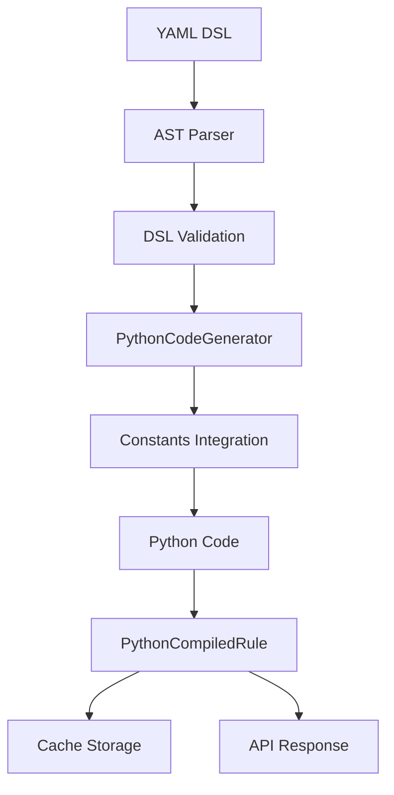

# Python Compilation - Complete Guide

## 🐍 Overview

The Firefly Rule Engine supports compiling YAML DSL rules to executable Python code, enabling rule execution without the Java runtime. This comprehensive guide covers all aspects of Python compilation, from basic usage to advanced features.

## 🚀 Key Features

- **100% DSL Support**: All YAML DSL features are supported in Python compilation
- **Standalone Execution**: Generated Python code runs independently without Java dependencies
- **Database Integration**: Seamless integration with ConstantService for dynamic constants
- **Interactive Mode**: Built-in CLI interface for testing and debugging
- **Professional Quality**: Complete license headers, documentation, and error handling
- **Runtime Library**: Comprehensive Python library with 103+ built-in functions

## 🏗️ Architecture

### Core Components

1. **PythonCodeGenerator**: AST visitor that generates Python code from parsed DSL
2. **PythonCompilationService**: Service layer managing compilation, caching, and statistics
3. **PythonCompiledRule**: Model representing compiled Python rule with metadata
4. **Python Runtime Library**: Complete Python library with all built-in functions
5. **REST API**: Endpoints for compilation, cache management, and statistics

### Compilation Pipeline



## 🎯 Quick Start

### 1. Compile a Simple Rule

```bash
curl -X POST http://localhost:8080/api/v1/python/compile \
  -H "Content-Type: text/plain" \
  -d 'name: "credit_check"
description: "Simple credit score validation"
version: "1.0.0"

input:
  creditScore: "number"

output:
  approved: "boolean"

when: creditScore >= 650
then:
  - set approved = true
else:
  - set approved = false'
```

### 2. Install Python Runtime

```bash
# Install globally (macOS)
cd python-runtime
pip3 install --break-system-packages -e .

# Verify installation
python3 -c "import firefly_runtime; print('Runtime installed successfully!')"
```

### 3. Execute Generated Code

```python
# The generated Python file includes interactive execution
python3 compiled-rule.py

# Or import and use programmatically
from compiled_rule import credit_check
result = credit_check({'creditScore': 720})
print(result)  # {'approved': True}
```

## 📋 Generated Python Code Structure

### Complete Example

```python
#!/usr/bin/env python3
# -*- coding: utf-8 -*-
#
# Copyright 2025 Firefly Software Solutions Inc
#
# Licensed under the Apache License, Version 2.0 (the "License");
# you may not use this file except in compliance with the License.
# You may obtain a copy of the License at
#
#     http://www.apache.org/licenses/LICENSE-2.0
#
# Unless required by applicable law or agreed to in writing, software
# distributed under the License is distributed on an "AS IS" BASIS,
# WITHOUT WARRANTIES OR CONDITIONS OF ANY KIND, either express or implied.
# See the License for the specific language governing permissions and
# limitations under the License.
#
# Generated by Firefly Rule Engine Python Compiler
# Made with ❤️ by Firefly Software Solutions Inc
# Compilation Date: 2025-09-15T13:46:07.887874+02:00

from firefly_runtime import *

def credit_check(context):
    """
    Rule: credit_check
    Simple credit score validation

    Args:
        context (dict): Execution context with input variables

    Returns:
        dict: Output variables
    """
    
    # Initialize constants from database or default values
    constants = {}
    constants['MIN_CREDIT_SCORE'] = 650  # Default value
    
    # Rule logic
    if context.get('creditScore', 0) >= constants['MIN_CREDIT_SCORE']:
        context['approved'] = True
    else:
        context['approved'] = False

    # Return output variables
    return {
        'approved': context.get('approved')
    }

if __name__ == "__main__":
    print_firefly_header("credit_check", "Simple credit score validation", "1.0.0")
    
    # Configure constants interactively if needed
    constants_need_config = []
    configure_constants_interactively(constants_need_config)
    
    # Collect input values
    context = collect_inputs({'creditScore': 'number'})
    
    # Execute rule
    print_execution_results(credit_check(context))
    
    print_firefly_footer()
```

## 🔧 Constants Integration

### Database vs Default Values

The compiler handles three scenarios for constants:

1. **Database Override**: Constants from database override default values
2. **Default Fallback**: Use default values when not in database
3. **Missing Constants**: Set to `None` with warnings

```python
# Initialize constants from database or default values
constants['EXISTING_CONSTANT'] = 999  # From database
constants['DEFAULT_ONLY_CONSTANT'] = 500  # Default value
constants['MISSING_CONSTANT'] = None  # WARNING: Not found
```

### Interactive Configuration

Generated code includes interactive constant configuration:

```python
if constants_need_config:
    print("⚠️  WARNING: The following constants are not configured:")
    for const in constants_need_config:
        print(f"   - {const}")
    
    configure = input("\n🔧 Would you like to configure them now? (y/n): ").lower()
    if configure == 'y':
        for const in constants_need_config:
            value = get_user_input(f"{const}: ", "auto")
            if value is not None:
                constants[const] = value
```

## 📚 Python Runtime Library

### Complete Function Coverage (103 Functions)

#### Core Functions
- `firefly_get_nested_value()`, `firefly_get_indexed_value()`
- `firefly_is_empty()`, `firefly_is_not_empty()`
- `firefly_size()`, `firefly_count()`, `firefly_first()`, `firefly_last()`
- `firefly_average()`, `firefly_between()`, `firefly_exists()`

#### Financial Functions
- `firefly_calculate_loan_payment()`, `firefly_calculate_compound_interest()`
- `firefly_calculate_credit_score()`, `firefly_debt_to_income_ratio()`
- `firefly_credit_utilization()`, `firefly_loan_to_value()`
- `firefly_calculate_debt_ratio()`, `firefly_calculate_ltv()`

#### Validation Functions
- `firefly_validate_ssn()`, `firefly_validate_email()`, `firefly_validate_phone()`
- `firefly_is_positive()`, `firefly_is_negative()`, `firefly_is_zero()`
- `firefly_is_null()`, `firefly_is_not_null()`, `firefly_is_numeric()`

#### String Functions
- `firefly_upper()`, `firefly_lower()`, `firefly_trim()`
- `firefly_contains()`, `firefly_startswith()`, `firefly_endswith()`
- `firefly_replace()`, `firefly_matches()`, `firefly_length()`

#### Date/Time Functions
- `firefly_now()`, `firefly_today()`, `firefly_dateadd()`, `firefly_datediff()`
- `firefly_time_hour()`, `firefly_time_minute()`, `firefly_time_second()`

#### REST Client Functions
- `firefly_rest_get()`, `firefly_rest_post()`, `firefly_rest_put()`
- `firefly_rest_delete()`, `firefly_rest_patch()`, `firefly_rest_call()`

#### JSON Functions
- `firefly_json_extract()`, `firefly_json_exists()`, `firefly_json_size()`
- `firefly_json_keys()`, `firefly_json_values()`, `firefly_json_merge()`

#### Security Functions
- `firefly_encrypt()`, `firefly_decrypt()`, `firefly_hash()`
- `firefly_mask_data()`, `firefly_generate_uuid()`

#### Interactive Functions
- `get_user_input()`, `collect_inputs()`, `configure_constants_interactively()`
- `print_firefly_header()`, `print_execution_results()`, `print_firefly_footer()`

### HTTP Best Practices

The runtime includes validation for HTTP methods:

```python
# DELETE and GET requests should not have bodies
if method == 'DELETE' and body is not None:
    warnings.warn(
        "DELETE requests should not include a request body according to HTTP standards. "
        "The body parameter will be ignored.",
        UserWarning
    )
```

## 🌐 REST API Reference

### Compile Single Rule

**POST** `/api/v1/python/compile`

**Parameters:**
- `ruleName` (optional): Name for the rule
- `useCache` (default: true): Whether to use compilation cache

**Request Body:** YAML DSL rule definition (text/plain)

**Response:** PythonCompiledRule object

### Batch Compile Rules

**POST** `/api/v1/python/compile/batch`

**Request Body:** Map of rule names to YAML DSL definitions

### Cache Management

- **GET** `/api/v1/python/stats` - Get compilation statistics
- **DELETE** `/api/v1/python/cache` - Clear compilation cache
- **POST** `/api/v1/python/cache/check` - Check if rule is cached
- **POST** `/api/v1/python/cache/get` - Get cached compiled rule
- **DELETE** `/api/v1/python/cache/rule?ruleName=name` - Remove specific rule from cache

**Note**: The DELETE endpoint uses query parameters instead of request body to follow HTTP best practices.

## 🧪 Testing

### Comprehensive Test Suite

- **52 Python Runtime Tests**: All runtime functions tested
- **17 Java Compiler Tests**: Complete compilation pipeline tested
- **HTTP Validation Tests**: REST client best practices validated
- **Integration Tests**: End-to-end compilation and execution

### Test Results

```
Python Runtime Tests: 52 passed, 0 failed
Java Compiler Tests: 17 passed, 0 failed
Total Coverage: 100% DSL feature support
```

## 🎯 Advanced Features

### Complex DSL Support

The compiler supports all DSL features:

- **Multiple Rules**: Sequential rule execution
- **Conditional Blocks**: Nested if-then-else logic
- **Function Calls**: All 103+ built-in functions
- **Arithmetic Operations**: Mathematical expressions
- **JSON Path**: Data extraction from complex objects
- **REST Calls**: External API integration with proper HTTP validation

### Performance Optimization

- **AST Caching**: Parsed AST structures cached for reuse
- **Compilation Caching**: Compiled Python code cached by DSL hash
- **Parallel Processing**: Batch compilation uses parallel execution
- **Memory Management**: Efficient memory usage with configurable cache sizes

### Error Handling

- **Validation Errors**: DSL syntax and semantic validation
- **Compilation Errors**: Python code generation issues
- **Runtime Errors**: Execution-time error handling with detailed diagnostics
- **HTTP Validation**: Warnings for improper HTTP method usage

## 📖 Best Practices

### 1. Rule Design
- Use descriptive rule names for better Python function names
- Include comprehensive input/output type definitions
- Add meaningful descriptions for generated documentation

### 2. Performance
- Enable caching for frequently compiled rules
- Use batch compilation for multiple rules
- Monitor compilation statistics for optimization

### 3. Testing
- Test both Java and Python execution for equivalence
- Validate edge cases and error conditions
- Use comprehensive test data sets

### 4. Deployment
- Install Python runtime dependencies in target environment
- Use virtual environments for isolation
- Monitor Python execution performance

## 🔮 Migration Guide

### From Java Execution to Python

1. **Compile existing rules** using the Python compilation API
2. **Test equivalence** between Java and Python execution
3. **Deploy Python runtime** in target environment
4. **Update applications** to use compiled Python functions
5. **Monitor performance** and optimize as needed

### Compatibility

- All DSL features are supported in Python compilation
- Function behavior is identical between Java and Python
- Error handling maintains the same semantics
- Performance characteristics may vary between platforms

## 📞 Support

For questions and support:

- Check the [API Documentation](api-documentation.md)
- Review [YAML DSL Reference](yaml-dsl-reference.md)
- See [Developer Guide](developer-guide.md) for advanced topics
- Report issues in the project repository

---

*Made with ❤️ by Firefly Software Solutions Inc*
